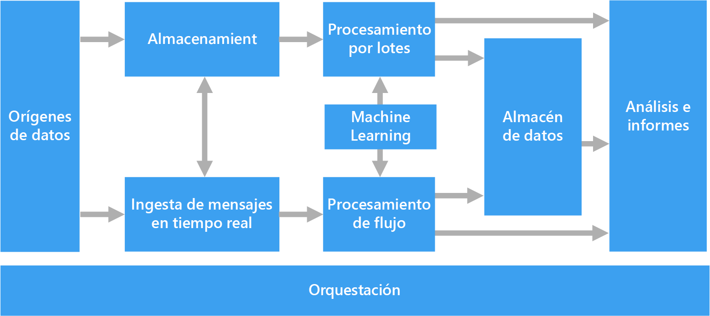
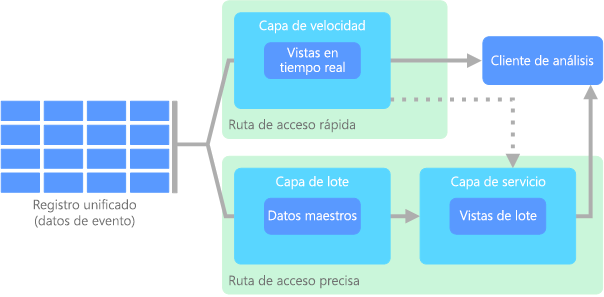
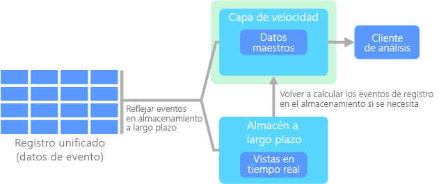

# Arquitecturas de macrodatos

Una arquitectura de macrodatos está diseñada para controlar la ingesta, el procesamiento y el análisis de datos que son demasiado grandes o complejos para los sistemas de bases de datos tradicionales. El umbral en el que las organizaciones entran en el reino de los macrodatos depende de las funcionalidades de los usuarios y sus herramientas. Para algunos, puede significar cientos de gigabytes de datos, mientras que para otros cientos de terabytes. A medida que avanzan las herramientas para trabajar con conjuntos de macrodatos, igual lo hace el significado de macrodatos. Este término cada vez se relaciona más con el valor que puede extraer de los conjuntos de datos a través del análisis avanzado, en lugar de que sea estrictamente el tamaño de los datos, aunque en estos casos tienden a ser bastante grandes.

Con el paso de los años, el panorama de los datos ha cambiado. Lo que se puede hacer, o se espera que se haga, con los datos ha cambiado. El costo del almacenamiento ha caído drásticamente, mientras que los medios por los que se recopilan los datos siguen creciendo. Algunos datos llegan a un ritmo elevado, lo que hace que haya una exigencia constante de recopilación y examen de los mismos. Otros llegan más lentamente, pero en grandes cantidades, a menudo en forma de décadas de datos históricos. Es posible que se enfrente a un problema de análisis avanzado o a uno que requiera Machine Learning. Estos son los problemas que las arquitecturas de macrodatos intentan resolver.

Las soluciones de macrodatos suelen implicar uno o varios de los tipos siguientes de cargas de trabajo:

* Procesamiento por lotes de orígenes de macrodatos en reposo.
* Procesamiento en tiempo real de macrodatos en movimiento.
* Exploración interactiva de macrodatos.
* Análisis predictivo y aprendizaje automático.

Considere la posibilidad de usar arquitecturas de macrodatos cuando necesite:

* Almacenar y procesar datos en volúmenes demasiado grandes para una base de datos tradicional.
* Transformar datos no estructurados para el análisis y la creación de informes.
* Capturar, procesar y analizar flujos no asociados de datos en tiempo real, o con una latencia baja.

## Componentes de una arquitectura de macrodatos

El siguiente diagrama muestra los componentes lógicos que puede contener una arquitectura de macrodatos. Es posible que las soluciones individuales no contengan todos los elementos de este diagrama.

 

La mayoría de las arquitecturas de macrodatos incluyen algunos de los componentes siguientes (o todos ellos):

* **Orígenes de datos**. Todas las soluciones de macrodatos se inician con uno o varios orígenes de datos. Algunos ejemplos son:

    * Almacenes de datos de aplicación, como bases de datos relacionales.
    * Archivos estáticos generados por aplicaciones, como archivos de registro de servidor web.
    * Orígenes de datos en tiempo real, como dispositivos de IoT.

* **Almacenamiento de datos**. Los datos de las operaciones de procesamiento por lotes se almacenan normalmente en un almacén de archivos distribuido que puede contener importantes cantidades de archivos grandes en diferentes formatos. Este tipo de almacén se suele denominar *Data Lake*. Las opciones para implementar este almacenamiento son Azure Data Lake Store o lo contenedores de blob en Azure Storage.

* **Procesamiento por lotes**. Como los conjuntos de datos son tan grandes, a menudo una solución de macrodatos debe procesar los archivos de datos mediante trabajos por lotes de ejecución prolongada para filtrar, agregar o preparar de cualquier otra forma los datos para su análisis. Normalmente estos trabajos implican leer archivos de código fuente, procesarlos y escribir la salida en nuevos archivos. Las opciones incluyen la ejecución de trabajos de U-SQL en Azure Data Lake Analytics, el uso de Hive, Pig o trabajos personalizados de Map/Reduce en un clúster de HDInsight Hadoop, o el uso de programas de Java, Scala o Python en un clúster de HDInsight Spark.

* **Ingesta de mensajes en tiempo real**. Si la solución incluye orígenes en tiempo real, la arquitectura debe incluir una manera de capturar y almacenar los mensajes en tiempo real para el procesamiento de flujos. Podría tratarse de un sencillo almacén de datos, donde se colocan los mensajes entrantes en una carpeta para su procesamiento. Sin embargo, muchas soluciones necesitan un almacén de ingesta de mensajes para que actúe como búfer de mensajes y para admitir el procesamiento de escalabilidad horizontal, la entrega confiable y otra semántica de puesta en cola de mensajes. Esta parte de una arquitectura de streaming a menudo se conoce como almacenamiento en búfer de flujos. Entre las opciones se incluyen Azure Event Hubs, Azure IoT Hubs y Kafka.

* **Procesamiento de flujos**. Una vez capturados los mensajes en tiempo real, la solución debe procesarlos filtrando, agregando o bien preparando los datos para su análisis. Los datos de secuencias procesados se escriben entonces en un receptor de salida. Azure Stream Analytics proporciona un servicio de procesamiento de secuencias administrado basado en consultas SQL de ejecución permanente que operan en secuencias sin enlazar. También puede utilizar tecnologías de streaming de código abierto como Storm y Spark Streaming en un clúster de HDInsight.

* **Almacén de datos analíticos**. Muchas soluciones de macrodatos preparan los datos para el análisis y luego sirven los datos procesados en un formato estructurado que se puede consultar mediante herramientas de análisis. El almacén de datos analíticos que se utiliza para atender estas consultas puede ser un almacén de datos relacional de estilo Kimball, como se ve en la mayoría de soluciones tradicionales de inteligencia empresarial. También es posible que los datos se presenten a través de una tecnología NoSQL de baja latencia como HBase, o una base de datos de Hive interactiva que proporciona una abstracción de metadatos sobre los archivos de datos en el almacén de datos distribuidos. Azure SQL Data Warehouse proporciona un servicio administrado para el almacenamiento de datos a gran escala basado en la nube. HDInsight admite Interactive Hive, HBase y Spark SQL, que también se puede utilizar para proporcionar datos par el análisis.

* **Análisis e informes**. El objetivo de la mayoría de soluciones de macrodatos consiste en proporcionar información sobre los datos a través de análisis e informes. Para permitir que los usuarios analicen los datos, la arquitectura puede incluir una capa de modelado de datos, como un cubo OLAP multidimensional o un modelo de datos tabulares en Azure Analysis Services. También podría admitir inteligencia empresarial con características de autoservicio mediante las tecnologías de modelado y visualización en Microsoft Power BI o Microsoft Excel. Los análisis y la creación de informes también pueden adoptar la forma de exploración interactiva de datos por parte de científicos o analistas de datos. En estos casos, muchos servicios de Azure admiten bloc de notas analíticos, como Jupyter, lo cual permite a estos usuarios aprovechar sus conocimientos existentes con Python o R. En el caso de la exploración de datos a gran escala, puede utilizar Microsoft R Server, tanto de manera independiente como con Spark.

* **Orquestación**. La mayoría de las soluciones de macrodatos constan de operaciones de procesamiento de datos repetidas, encapsuladas en flujos de trabajo, que transforman los datos de origen, mueven datos entre varios orígenes y receptores, cargan los datos procesados en un almacén de datos analítico o envían los resultados directamente a un informe o un panel. Para automatizar estos flujos de trabajo, puede utilizar una tecnología de coordinación como Azure Data Factory o Apache Oozie y Sqoop.

## Arquitectura lambda

Cuando se trabaja con grandes conjuntos de datos, es posible que se tarde mucho tiempo en ejecutar el tipo de consultas que los clientes necesitan. Dichas consultas no se puede realizar en tiempo real y, a menudo, requieren algoritmos como [MapReduce](https://en.wikipedia.org/wiki/MapReduce) que funcionan en paralelo en todo el conjunto de datos. Luego, los resultados se almacenan por separado de los datos sin procesar y se utilizan para realizar consultas.

Un inconveniente de este enfoque es que introduce latencia (si el procesamiento tarda varias horas, una consulta puede devolver resultados con varias horas de antigüedad). Lo ideal sería que deseara obtener resultados en tiempo real (quizás con alguna pérdida de precisión) y combinar dichos resultados con los de los análisis por lotes.

El **arquitectura lambda**, que Nathan Marz propuso por primera vez, aborda este problema mediante la creación de dos rutas de acceso para el flujo de datos. Todos los datos que entran en el sistema atraviesan estas dos rutas de acceso:

* Una **capa por lotes** (ruta de acceso preciso) almacena todos los datos de entrada en su forma sin formato y realiza el procesamiento por lotes de los datos. El resultado de este procesamiento se almacena en forma de **vista por lotes**.

* Una **capa de velocidad** (ruta de acceso rápido) analiza los datos en tiempo real. Este nivel está diseñado para que tenga una latencia baja, a costa de la precisión.

La capa por lotes se distribuye en una **capa de servicios** que indexa la vista por lotes para realizar consultas eficaces. La capa de velocidad actualiza el nivel de servicios con actualizaciones incrementales en función de los datos más recientes.

Los datos que fluyen en la ruta de acceso rápido están limitados por los requisitos de latencia que impone la capa de velocidad, con el fin de que puedan procesarse lo antes posible. A menudo esto requiere ceder cierto nivel de precisión a cambio de que los datos estén listos lo más rápidamente posible. Por ejemplo, considere un escenario de IoT en el que un gran número de sensores de temperatura envían datos de telemetría. La capa de velocidad se puede utilizar para procesar una ventana de tiempo variable de los datos de entrada. 

Los datos que fluyen en la ruta de acceso preciso, por otro lado, no están sujetos a los mismos requisitos de latencia baja. Esto permite que el cálculo tenga gran exactitud en grandes conjuntos de datos, lo que puede requerir mucho tiempo. 

Finalmente, las rutas de acceso rápido y preciso convergen en la aplicación de cliente de análisis. Si el cliente necesita para mostrar los datos rápidamente, aunque probablemente a costa de algo de precisión, obtendrá el resultado de la ruta de acceso rápido. En caso contrario, si lo que desea son datos más preciso, aunque no pueda mostrarlos rápidamente, seleccionará los resultados de la ruta de acceso preciso. En otras palabras, la ruta de acceso rápido tiene datos para una ventana de tiempo relativamente pequeña, después de lo cual los resultados se pueden actualizar con datos más precisos de la ruta de acceso preciso.

Los datos sin formato almacenados en la capa por lotes no de pueden modificar. Los datos de entrada siempre se anexan a los datos existentes y los datos anteriores nunca se sobrescriben. Todos los cambios en el valor de un dato concreto se almacenan como un nuevo registro de eventos con marca de tiempo. Esto permite el recálculo en cualquier momento del historial de los datos recopilados. La capacidad para volver a calcular la vista por lotes desde los datos sin formato originales es importante, porque permite que se creen nuevas vistas a medida que el sistema evoluciona. 

## Arquitectura kappa

Una desventaja de la arquitectura lamba es su complejidad. La lógica de procesamiento aparece en dos lugares diferentes, &mdash; las rutas de acceso rápido y preciso, &mdash; que usan marcos distintos. Esto conduce a la duplicación de la lógica de cálculo y a la complejidad de administrar la arquitectura de ambas rutas de acceso.

La **arquitectura kappa** la propuso Jay Kreps como alternativa a la arquitectura lambda. Tiene los mismos objetivos básicos que la arquitectura lambda, pero con una diferencia importante: todos los flujos de datos atraviesan una única ruta de acceso, para lo que usan un sistema de procesamiento de flujos. 

Hay algunas similitudes con capa por lotes de la arquitectura lambda, como que los datos de los eventos son inmutables y todos son recopilados, en lugar de ser un subconjunto. Los datos se ingieren como un flujo de eventos en un registro unificado distribuido y que tolera errores. Estos eventos están ordenados y el estado actual de un evento cambia solo cuando se anexa un nuevo evento. De forma parecida a la capa de velocidad de la arquitectura lambda, todo el procesamiento de eventos se realiza en el flujo de entrada y se conserva como una vista en tiempo real. 

Si necesita recalcular todo el conjunto de datos (equivalente a lo que la capa por lotes hace en la arquitectura lambda), solo hay que reproducir el flujo, que normalmente usa el paralelismo para completar el cálculo a tiempo.

## Internet de las cosas (IoT)

Desde un punto de vista práctico, Internet de las cosas (IoT) representa cualquier dispositivo conectado a Internet. Esto incluye el PC, teléfono móvil, smartwatch, termostato inteligente, refrigerador inteligente, automóvil con conexión a Internet, implantes para el control cardiaco y cualquier otra cosa que se conecte a Internet y envíe o reciba datos. El número de dispositivos conectados crece a diario, así como la cantidad de datos que recopilan. A menudo, estos datos se recopilan en entornos muy limitados y, en ocasiones, con una latencia alta. En otros casos, miles o millones de dispositivos envían los datos desde entornos de baja latencia, lo que requiere la capacidad para ingerir rápidamente los datos y procesarlos según corresponda. Por lo tanto, se requiere un planeamiento adecuado para controlar estas restricciones y requisitos únicos.

Las arquitecturas basadas en eventos son básicas para las soluciones de IoT. En el siguiente diagrama se muestra una posible arquitectura lógica de IoT. En él se resaltan los componentes del flujo de eventos de la arquitectura.

La **puerta de enlace de nube** ingiere eventos de dispositivo en el límite de nube, mediante un sistema de mensajería confiable y de baja latencia.

Los dispositivos pueden enviar eventos directamente a la puerta de enlace de nube, o a través de una **puerta de enlace de campo**. Una puerta de enlace de campo es un dispositivo o software especializado, que normalmente se coloca con los dispositivos, que recibe eventos y los reenvía a la puerta de enlace de nube. La puerta de enlace de campo también puede procesar previamente los eventos de dispositivo sin formato y realizar funciones como filtrado, agregación o transformación de protocolo.

Después de la ingesta, los eventos pasan por uno o varios **procesadores de flujo** que pueden enrutar los datos (por ejemplo, al almacenamiento) o realizar análisis u otras tareas de procesamiento.

Estos son algunos tipos comunes de procesamiento. (Ciertamente, esta lista no es exhaustiva).

- Escribir datos de eventos en almacenamiento en frío, para archivado o análisis por lotes.

- Análisis de ruta de acceso activa, que analiza el flujo de eventos (casi) en tiempo real para detectar anomalías, reconocer patrones durante ventanas de tiempo consecutivas o desencadenar alertas cuando se produce una condición especifica en el flujo. 

- El control de los tipos especiales de mensajes que no son de telemetría de los dispositivos, tales como notificaciones y alarmas. 

- Machine Learning

Los cuadros que aparecen en gris sombreado muestran los componentes de un sistema IoT que no están directamente relacionados con el flujo de eventos, pero se incluyen aquí para ofrecer una visión completa.

- El **registro de dispositivos** es una base de datos de los dispositivos aprovisionados, incluidos los identificadores de dispositivo y habitualmente los metadatos de dispositivos, como la ubicación.

- La **API de aprovisionamiento** es una interfaz externa común para el aprovisionamiento y el registro de nuevos dispositivos.

- Algunas soluciones IoT permiten el envío de **mensajes de comando y control** a los dispositivos.

Servicios de Azure correspondientes:

- [Azure IoT Hub](https://azure.microsoft.com/services/iot-hub/)
- [Azure Event Hubs](https://azure.microsoft.com/services/event-hubs/)
- [Azure Stream Analytics](https://azure.microsoft.com/services/stream-analytics/)  

Para más información acerca de IoT en Azure, lea la [arquitectura de referencia de IoT de Azure](https://azure.microsoft.com/updates/microsoft-azure-iot-reference-architecture-available/).

