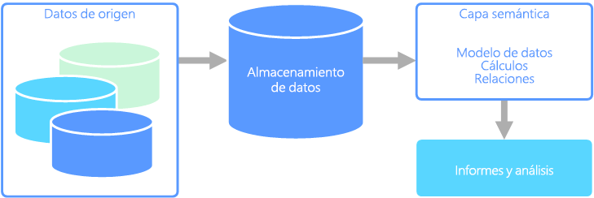

# Modelos semánticos

Un modelo de datos semánticos es un modelo conceptual que describe el significado de los elementos de datos que contiene. A menudo, las organizaciones usan sus propios términos, a veces emplean sinónimos o incluso diferentes significados para un mismo término. Por ejemplo, es posible que una base de datos de inventario realice el seguimiento de una pieza de un equipo con un identificador de recurso y un número de serie, mientras que una base de datos de ventas podría hacer referencia al número de serie como el identificador de recurso. No existe una manera sencilla de relacionar estos valores sin un modelo que describa la relación. 

Los modelos semánticos proporcionan un nivel de abstracción sobre el esquema de la base de datos, de forma que los usuarios no necesitan conocer las estructuras de datos subyacentes. Así resulta más fácil para los usuarios finales consultar los datos sin realizar agregados ni uniones sobre el esquema subyacente. Además, normalmente se asignan nombres más descriptivos a las columnas, de forma que el contexto y el significado de los datos resulten más obvios.

Los modelos semánticos se usan predominantemente en escenarios con mucha actividad de lectura, como el análisis y la inteligencia empresarial (OLAP), a diferencia del procesamiento de datos transaccionales (OLTP) con una elevada actividad de escritura. Esto se debe principalmente a la naturaleza de una capa semántica típica:

- Los comportamientos de agregación se establecen para que las herramientas de generación de informes los muestren correctamente.
- Se definen los cálculos y la lógica de negocios.
- Se incluyen cálculos orientados al tiempo.
- Se suelen integrar datos de varios orígenes. 

Tradicionalmente, la capa semántica se coloca sobre un almacenamiento de datos por estos motivos.

Hay dos tipos principales de modelos semánticos:

* **Tabular**. Utiliza construcciones de modelado relacional (modelo, tablas, columnas). Internamente, los metadatos se heredan de construcciones de modelado OLAP (cubos, dimensiones, medidas). El código y los scripts usan metadatos OLAP.
* **Multidimensional**. Usa construcciones de modelado OLAP tradicionales (cubos, dimensiones, medidas).

Servicio de Azure correspondiente:
- [Azure Analysis Services](https://azure.microsoft.com/services/analysis-services/)

## Ejemplo de caso de uso

Una organización tiene datos almacenados en una base de datos grande. Se desea poner estos datos a disposición de clientes y usuarios de negocios para que puedan crear sus propios informes y realizar análisis. Una opción es simplemente dar a dichos usuarios acceso directo a la base de datos. Sin embargo, esta opción tiene varias desventajas, incluida la administración de la seguridad y el control de acceso. Asimismo, el diseño de la base de datos, incluidos los nombres de las tablas y columnas, puede ser difícil de entender para los usuarios. Los usuarios tendrían que saber qué tablas consultar, cómo deberían combinarse esas tablas y conocer otra lógica de negocios que deba aplicarse para obtener los resultados correctos. Además, para empezar, los usuarios deberían conocer un lenguaje de consulta, como SQL. Esto suele provocar que varios usuarios generen informes con las mismas métricas, pero con resultados distintos.

Otra opción consiste en encapsular toda la información que necesitan los usuarios en un modelo semántico. Los usuarios pueden consultar el modelo semántico más fácilmente con la herramienta de generación informes que prefieran. Los datos proporcionados por el modelo semántico se extraen de un almacenamiento de datos, lo que garantiza que todos los usuarios vean una misma versión. El modelo semántico también proporciona nombres descriptivos de tablas y columnas, relaciones entre tablas, descripciones, cálculos y seguridad a nivel de fila.

## Características típicas del modelo semántico

Los modelos semánticos y el procesamiento analítico suelen presentar las siguientes características:

| Requisito | DESCRIPCIÓN |
| --- | --- |
| Esquema | Esquema durante la escritura, altamente aplicado|
| Usa transacciones | Sin  |
| Estrategia de bloqueo | None |
| Actualizable | No (normalmente es necesario recalcular el cubo) |
| Anexable | No (normalmente es necesario recalcular el cubo) |
| Carga de trabajo | Elevada actividad de lectura, solo lectura |
| Indización | Indexación multidimensional |
| Tamaño de los datos | Pequeño a mediano tamaño |
| Modelo | Multidimensional |
| Forma de los datos:| Cubo o esquema de estrella o copo de nieve |
| Flexibilidad de consulta | Muy flexible |
| Escala: | Grande (de decenas a centenares de GB) |

## Otras referencias

- [Almacenamiento de datos](../scenarios/data-warehousing.md)
- [Procesamiento analítico en línea (OLAP)](../scenarios/online-analytical-processing.md)
