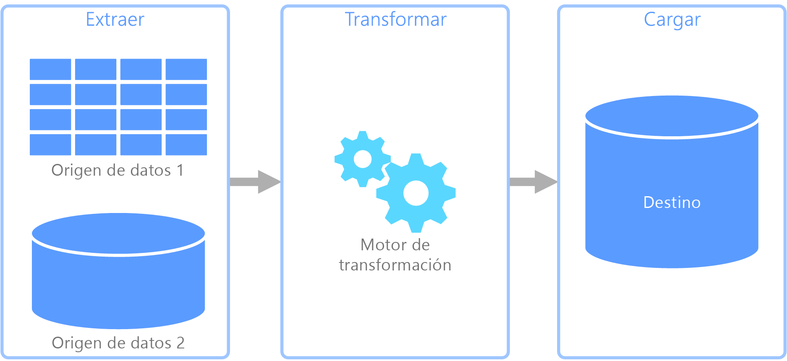
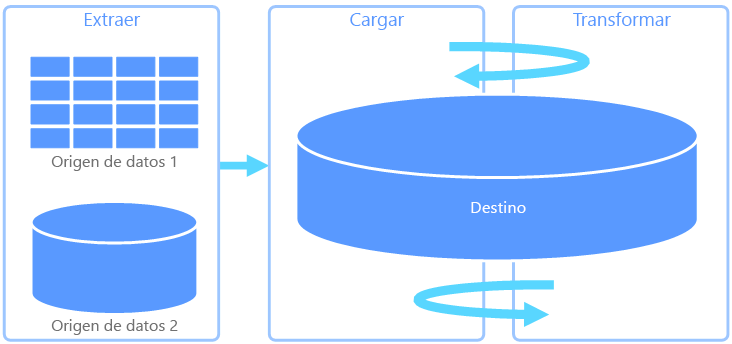
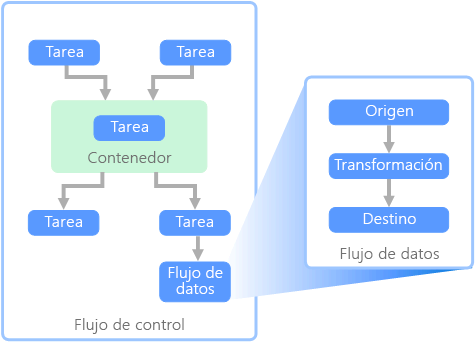

# Extracción, transformación y carga de datos (ETL)Extract, transform, and load (ETL)

Un problema habitual al que se enfrentan las organizaciones es cómo recopilar datos de varios orígenes, en varios formatos y moverlos a uno o a varios almacenes de datos.A common problem that organizations face is how to gathering data from multiple sources, in multiple formats, and move it to one or more data stores. El destino puede no ser el mismo tipo de almacén de datos que el origen y, a menudo, el formato es diferente, o es necesario dar forma o limpiar los datos antes de cargarlos en su destino final.The destination may not be the same type of data store as the source, and often the format is different, or the data needs to be shaped or cleaned before loading it into its final destination.

Con los años se han desarrollado varias herramientas, servicios y procesos para ayudarle a afrontar estos desafíos.Various tools, services, and processes have been developed over the years to help address these challenges. Independientemente del proceso que se utilice, hay una necesidad común de coordinar el trabajo y aplicar cierto nivel de transformación de los datos dentro de la canalización de datos.No matter the process used, there is a common need to coordinate the work and apply some level of data transformation within the data pipeline. Las secciones siguientes resaltan los métodos más habituales utilizados para realizar estas tareas.The following sections highlight the common methods used to perform these tasks.

## Extracción, transformación y carga de datos (ETL)Extract, transform, and load (ETL)

Extracción, transformación y carga (ETL) es una canalización de datos que se utiliza para recopilar datos de varios orígenes, transformar los datos según las reglas de negocio y cargarlos en un almacén de datos de destino.Extract, transform, and load (ETL) is a data pipeline used to collect data from various sources, transform the data according to business rules, and load it into a destination data store. El trabajo de transformación en ETL tiene lugar en un motor especializado y, a menudo, implica el uso de tablas de almacenamiento temporal para conservar los datos temporalmente a medida que estos se transforman y, finalmente, se cargan en su destino.The transformation work in ETL takes place in a specialized engine, and often involves using staging tables to temporarily hold data as it is being transformed and ultimately loaded to its destination.

La transformación de datos que tiene lugar a menudo conlleva varias operaciones como filtrado, ordenación, agregación, combinación de datos, limpieza de datos, desduplicación y validación de datos.The data transformation that takes place usually involves various operations, such as filtering, sorting, aggregating, joining data, cleaning data, deduplicating, and validating data.

Frecuentemente, las tres fases del proceso ETL se ejecutan en paralelo para ahorrar tiempo.Often, the three ETL phases are run in parallel to save time. Por ejemplo, mientras se extraen datos, puede que esté funcionando un proceso de transformación sobre los datos ya recibidos y de preparación para la carga, y puede que empiece a funcionar un proceso de carga sobre los datos preparados, en lugar de tener que esperar a que termine todo el proceso de extracción.For example, while data is being extracted, a transformation process could be working on data already received and prepare it for loading, and a loading process can begin working on the prepared data, rather than waiting for the entire extraction process to complete.

Servicio de Azure correspondiente:Relevant Azure service:
- [Azure Data Factory V2Azure Data Factory v2](https://azure.microsoft.com/services/data-factory/)

Otras herramientas:Other tools:
- [SQL Server Integration Services (SSIS)SQL Server Integration Services (SSIS)](/sql/integration-services/sql-server-integration-services)

## Extracción, carga y transformación (ELT)Extract, load, and transform (ELT)

Extracción, carga y transformación (ELT) difiere de ETL solo por la ubicación en la que se realiza la transformación.Extract, load, and transform (ELT) differs from ETL solely in where the transformation takes place. En la canalización de ELT, la transformación se produce en el almacén de datos de destino.In the ELT pipeline, the transformation occurs in the target data store. En lugar de usar un motor de transformación independiente, las funcionalidades de procesamiento del almacén de datos de destino se utilizan para transformar los datos.Instead of using a separate transformation engine, the processing capabilities of the target data store are used to transform data. Esto simplifica la arquitectura ya que permite quitar el motor de transformación de la canalización.This simplifies the architecture by removing the transformation engine from the pipeline. Otra ventaja de este enfoque es que al escalar el almacén de datos de destino también se escala el rendimiento de la canalización de ELT.Another benefit to this approach is that scaling the target data store also scales the ELT pipeline performance. No obstante, ELT solo funciona bien si el sistema de destino tiene la suficiente potencia para transformar los datos de forma eficaz.However, ELT only works well when the target system is powerful enough to transform the data efficiently.

Los casos de uso habituales para ELT están dentro del dominio de los macrodatos.Typical use cases for ELT fall within the big data realm. Por ejemplo, puede comenzar extrayendo todos los datos de origen a archivos planos en un almacenamiento escalable como el sistema de archivos distribuido de Hadoop (HDFS) o Azure Data Lake Store.For example, you might start by extracting all of the source data to flat files in scalable storage such as Hadoop distributed file system (HDFS) or Azure Data Lake Store. Se pueden utilizar tecnologías como Spark, Hive o PolyBase para consultar los datos de origen.Technologies such as Spark, Hive, or PolyBase can then be used to query the source data. El punto clave de ELT es que el almacén de datos que se usa para realizar la transformación es el mismo almacén de datos en el que se consumen en última instancia los datos.The key point with ELT is that the data store used to perform the transformation is the same data store where the data is ultimately consumed. Este almacén de datos lee directamente desde el almacenamiento escalable, en lugar de cargar los datos en su propio almacenamiento propietario.This data store reads directly from the scalable storage, instead of loading the data into its own proprietary storage. Este enfoque omite el paso de copia de datos que se da en ETL. Esta es una operación que lleva mucho tiempo en el caso de conjuntos de datos grandes.This approach skips the data copy step present in ETL, which can be a time consuming operation for large data sets.

En la práctica, el almacén de datos de destino es un [almacenamiento de datos](./data-warehousing.md) que usa un clúster de Hadoop (con Hive o Spark) o una instancia de SQL Data Warehouse.In practice, the target data store is a [data warehouse](./data-warehousing.md) using either a Hadoop cluster (using Hive or Spark) or a SQL Data Warehouse. En general, un esquema se superpone sobre los datos del archivo plano en el momento de la consulta y se almacena como una tabla, lo cual permite que se puedan realizar consultas a los datos como en cualquier otra tabla del almacén de datos.In general, a schema is overlaid on the flat file data at query time and stored as a table, enabling the data to be queried like any other table in the data store. Estas se conocen como tablas externas porque los datos no residen en el almacenamiento administrado por el almacén de datos en sí mismo, sino en algunos almacenamientos escalables externos.These are referred to as external tables because the data does not reside in storage managed by the data store itself, but on some external scalable storage. 

El almacén de datos solo administra el esquema de los datos y aplica el esquema en la lectura.The data store only manages the schema of the data and applies the schema on read. Por ejemplo, un clúster de Hadoop que use Hive describiría una tabla de Hive en la que el origen de datos es, efectivamente, una ruta de acceso a un conjunto de archivos en HDFS.For example, a Hadoop cluster using Hive would describe a Hive table where the data source is effectively a path to a set of files in HDFS. En SQL Data Warehouse, PolyBase puede lograr el mismo resultado &mdash; creando una tabla en los datos almacenados de forma externa a la propia base de datos.In SQL Data Warehouse, PolyBase can achieve the same result &mdash; creating a table against data stored externally to the database itself. Una vez cargados los datos de origen, los datos presentes en las tablas externas se pueden procesar mediante las funcionalidades del almacén de datos.Once the source data is loaded, the data present in the external tables can be processed using the capabilities of the data store. En escenarios de macrodatos, esto significa que el almacén de datos debe ser capaz de realizar un procesamiento paralelo masivo (MPP) que divide los datos en fragmentos más pequeños y distribuye el procesamiento de los fragmentos en varias máquinas en paralelo.In big data scenarios, this means the data store must be capable of massively parallel processing (MPP), which breaks the data into smaller chunks and distributes processing of the chunks across multiple machines in parallel.

La fase final de la canalización de ELT suele transformar los datos de origen a un formato final que es más eficaz para los tipos de consultas que se deben admitir.The final phase of the ELT pipeline is typically to transform the source data into a final format that is more efficient for the types of queries that need to be supported. Por ejemplo, se pueden realizar particiones en los datos.For example, the data may be partitioned. Además, ELT podría usar formatos de almacenamiento optimizado como Parquet, que almacena datos orientados a filas en forma de columnas y proporciona una indexación optimizada.Also, ELT might use optimized storage formats like Parquet, which stores row-oriented data in a columnar fashion and providess optimized indexing. 

Servicio de Azure correspondiente:Relevant Azure service:

- [Azure SQL Data WarehouseAzure SQL Data Warehouse](/azure/sql-data-warehouse/sql-data-warehouse-overview-what-is)
- [HDInsight con HiveHDInsight with Hive](/azure/hdinsight/hadoop/hdinsight-use-hive)
- [Azure Data Factory V2Azure Data Factory v2](https://azure.microsoft.com/services/data-factory/)
- [Oozie en HDInsightOozie on HDInsight](/azure/hdinsight/hdinsight-use-oozie-linux-mac)

Otras herramientas:Other tools:

- [SQL Server Integration Services (SSIS)SQL Server Integration Services (SSIS)](/sql/integration-services/sql-server-integration-services)

## Flujo de datos y flujo de controlData flow and control flow

En el contexto de las canalizaciones de datos, el flujo de control garantiza el procesamiento ordenado de un conjunto de tareas.In the context of data pipelines, the control flow ensures orderly processing of a set of tasks. Para aplicar el orden de procesamiento correcto de estas tareas, se usan las restricciones de precedencia.To enforce the correct processing order of these tasks, precedence constraints are used. Puede considerar estas restricciones como conectores en un diagrama de flujo de trabajo, como se indica en la siguiente imagen.You can think of these constraints as connectors in a workflow diagram, as shown in the image below. Cada tarea tiene un resultado como, por ejemplo, correcto, error o conclusión.Each task has an outcome, such as success, failure, or completion. Cualquier tarea posterior no comenzará el procesamiento hasta que su predecesora se haya completado con uno de estos resultados.Any subsequent task does not initiate processing until its predecessor has completed with one of these outcomes.

Los flujos de control ejecutan flujos de datos como una tarea.Control flows execute data flows as a task. En una tarea Flujo de datos, los datos se extraen de un origen, se transforman o se cargan en un almacén de datos.In a data flow task, data is extracted from a source, transformed, or loaded into a data store. La salida de una tarea Flujo de datos puede ser la entrada de la siguiente tarea, y los flujos de datos se pueden ejecutar en paralelo.The output of one data flow task can be the input to the next data flow task, and data flowss can run in parallel. A diferencia de los flujos de control, no se pueden agregar restricciones entre las tareas de un flujo de datos.Unlike control flows, you cannot add constraints between tasks in a data flow. Sin embargo, puede agregar un visor de datos para observar los datos a medida que cada tarea los va procesando.You can, however, add a data viewer to observe the data as it is processed by each task.

En el diagrama anterior, hay varias tareas en el flujo de control, una de las cuales es una tarea Flujo de datos.In the diagram above, there are several tasks within the control flow, one of which is a data flow task. Una de las tareas se anida dentro de un contenedor.One of the tasks is nested within a container. Los contenedores se pueden usar para proporcionar una estructura para las tareas, proporcionando una unidad de trabajo.Containers can be used to provide structure to tasks, providing a unit of work. Un ejemplo es la repetición de elementos en una colección, como los archivos de una carpeta o las instrucciones de una base de datos.One such example is for repeating elements within a collection, such as files in a folder or database statements.

Servicio de Azure correspondiente:Relevant Azure service:
- [Azure Data Factory V2Azure Data Factory v2](https://azure.microsoft.com/services/data-factory/)

Otras herramientas:Other tools:
- [SQL Server Integration Services (SSIS)SQL Server Integration Services (SSIS)](/sql/integration-services/sql-server-integration-services)

## Opciones de tecnologíaTechnology choices

- [Almacenes de datos de procesamiento de transacciones en línea (OLTP)Online Transaction Processing (OLTP) data stores](../technology-choices/oltp-data-stores.md)
- [Almacenes de datos de procesamiento analítico en línea (OLAP)Online Analytical Processing (OLAP) data stores](../technology-choices/olap-data-stores.md)
- [Almacenamientos de datosData warehouses](../technology-choices/data-warehouses.md)
- [Orquestación de canalizacionesPipeline orchestration](../technology-choices/pipeline-orchestration-data-movement.md)
