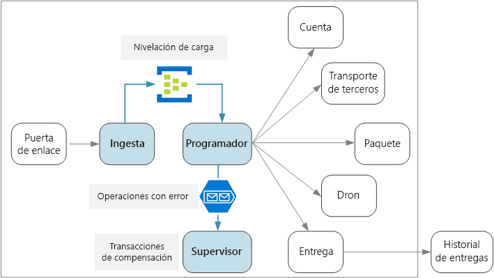
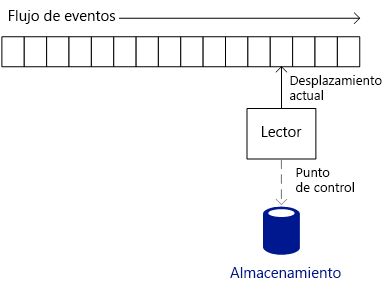
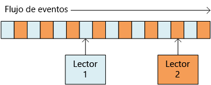
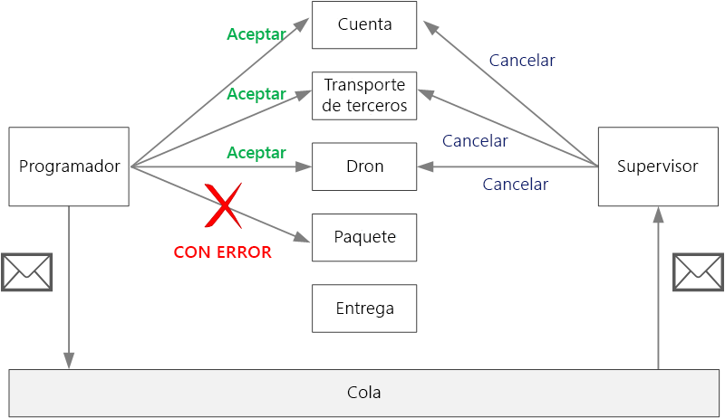

# <a name="designing-microservices-ingestion-and-workflow"></a>Diseño de microservicios: ingesta y flujo de trabajo

Con frecuencia los microservicios tienen un flujo de trabajo que abarca varios servicios en una única transacción. El flujo de trabajo debe ser confiable; no se pueden perder transacciones ni dejarlas en estado parcialmente completado. También es fundamental controlar la tasa de ingesta de solicitudes entrantes. Como hay muchos servicios pequeños que se comunican entre sí, una ráfaga de solicitudes entrantes puede sobrecargar la comunicación entre los servicios. 



## <a name="the-drone-delivery-workflow"></a>El flujo de trabajo de entrega con dron

En la aplicación Drone Delivery, se deben realizar las siguientes operaciones para programar una entrega:

1. Comprobar el estado de la cuenta del cliente (servicio Account)
2. Crear una nueva entidad de paquete (servicio Package)
3. Comprobar si se requiere transporte de terceros en esta entrega, según las ubicaciones de recogida y entrega (servicio Third-party Transportation)
4. Programar un dron para la recogida (servicio Dron)
5. Crear una nueva entidad de entrega (servicio Delivery)

Este es el núcleo de la aplicación entera, por lo que el proceso de extremo a extremo debe ser efectivo y confiable. Se deben abordar algunas dificultades en concreto:

- **Redistribución de la carga.** Demasiadas solicitudes de cliente pueden sobrecargar el sistema con tráfico de red entre servicios. También se pueden sobrecargar las dependencias de back-end, como almacenamiento o servicios remotos. La reacción de estas dependencias puede ser limitar los servicios que las llaman y crear una resistencia en el sistema. Por lo tanto, es importante distribuir la carga de las solicitudes que entran en el sistema y colocarlas en un búfer o cola para su procesamiento. 

- **Entrega garantizada**. Para evitar la eliminación de solicitudes de cliente, el componente de ingesta debe garantizar una entrega por lo menos de mensajes. 

- **Control de errores**. Si alguno de los servicios devuelve un código de error o experimenta un error no transitorio, la entrega no se puede programar. Un código de error podría indicar una condición de error esperada (por ejemplo, se suspende la cuenta del cliente) o un error inesperado del servidor (HTTP 5xx). Un servicio también puede estar no disponible, lo que hace que se agote el tiempo de espera en la llamada de red. 

Primero, examinaremos la parte de ingesta de la ecuación &mdash; cómo el sistema puede ingerir solicitudes de usuario entrantes con un alto rendimiento. A continuación, se considerará cómo la aplicación de entrega con dron puede implementar un flujo de trabajo confiable. Resulta que el diseño del subsistema de ingesta afecta al back-end de flujo de trabajo. 

## <a name="ingestion"></a>Ingesta de datos

En función de los requisitos empresariales, el equipo de desarrollo identificó los siguientes requisitos de ingesta no funcionales:

- Rendimiento sostenido de 10 000 solicitudes por segundo.
- Posibilidad de administrar picos de hasta 50 000 por segundo sin rechazar solicitudes de cliente o agotar el tiempo de espera.
- Latencia inferior a 500 ms en el percentil 99.

El requisito para administrar los picos ocasionales de tráfico presenta una dificultad de diseño. En teoría, el sistema se podría escalar horizontalmente para administrar el tráfico máximo esperado. Sin embargo, aprovisionar esos muchos recursos no sería muy eficiente. La mayor parte del tiempo, la aplicación no necesitará esa capacidad tan grande, así que habrá núcleos inactivos, lo que costará dinero sin agregar valor.

Un enfoque mejor es colocar las solicitudes entrantes en un búfer y dejar que el búfer actúe como distribuidor de la carga. Con este diseño, el servicio Ingestion debe poder administrar la tasa máxima de ingesta durante períodos cortos, pero los servicios back-end solo tienen que administrar la carga máxima sostenida. Al realizar el almacenamiento en búfer en el front-end, los servicios back-end no deberían tener la necesidad de administrar grandes picos de tráfico. Con la escala necesaria para la aplicación Drone Delivery, [Azure Event Hubs](/azure/event-hubs/) es una buena elección para la distribución de la carga. Event Hubs ofrece baja latencia y alto rendimiento, y es una solución rentable con elevados volúmenes de ingesta. 

En nuestras pruebas, hemos usado un centro de eventos de nivel estándar con 32 particiones y 100 unidades de procesamiento. Se observó una ingesta de unos 32 000 eventos por segundo, con una latencia de 90 ms aproximadamente. Actualmente, el límite predeterminado es de 20 unidades de procesamiento, pero los clientes de Azure pueden solicitar más si rellenan una solicitud de soporte técnico. Consulte [Cuotas de Event Hubs](/azure/event-hubs/event-hubs-quotas) para más información. Al igual que con todas las métricas de rendimiento, son muchos los factores que pueden afectar al rendimiento, como el tamaño de la carga de mensajes, así que no interprete estas cifras como un punto de referencia. Si se necesita más rendimiento, el servicio Ingestion se puede particionar entre más de un centro de eventos. Para capacidades de proceso incluso mayores, [Event Hubs Dedicated](/azure/event-hubs/event-hubs-dedicated-overview) ofrece implementaciones de un único inquilino que pueden ingresar más de 2 millones de eventos por segundo.

Es importante comprender cómo Event Hubs puede conseguir este rendimiento tan alto, porque eso afecta a cómo el cliente debe consumir los mensajes de Event Hubs. Event Hubs no implementa una *cola*, sino un *flujo de eventos*. 

Con una cola, un consumidor individual puede quitar un mensaje de la cola y el siguiente consumidor no verá ese mensaje. Por tanto, las colas le permiten usar un [patrón Competing Consumers](../patterns/competing-consumers.md) para procesar los mensajes en paralelo y mejorar la escalabilidad. Para una mayor resistencia, el consumidor mantiene un bloqueo sobre el mensaje y libera el bloqueo cuando se termina de procesar el mensaje. Si se produce un error en el consumidor &mdash; por ejemplo, el nodo no funciona en los bloqueos &mdash; se agota el tiempo de espera del bloqueo y el mensaje se devuelve a la cola. 


Por otro lado, Event Hubs, usa semántica de streaming. Los consumidores leen la secuencia de forma independiente, a su propio ritmo. Cada consumidor es responsable de realizar el seguimiento de su posición actual en la secuencia. Un consumidor debe escribir su posición actual en el almacenamiento persistente según un intervalo predefinido. De este modo, si el consumidor experimenta un error (por ejemplo, el consumidor se bloquea o se produce un error en el host), una nueva instancia puede reanudar la lectura de la secuencia desde la última posición registrada. Este proceso se denomina *creación de puntos de control*. 

Por motivos de rendimiento, un consumidor no crea generalmente puntos de control después de cada mensaje,  sino que lo hace según intervalos fijos, por ejemplo, después de procesar *n* mensajes, o cada *n* segundos. En consecuencia, si se produce un error en un consumidor, algunos eventos podrían procesarse dos veces, porque las nuevas instancias siempre se toman del último punto de control. Hay una compensación: la existencia de frecuentes puntos de control puede dañar el rendimiento, pero su escasez significa que se reproducirán más eventos tras un error.  


 
Event Hubs no está diseñado para la competencia entre consumidores. Aunque varios consumidores pueden leer una secuencia, cada uno la recorre de forma independiente. Por el contrario, Event Hubs usa un patrón de consumidores particionados. Un centro de eventos tiene hasta 32 particiones. El escalado horizontal se logra mediante la asignación de un consumidor independiente a cada partición.

¿Qué significa esto para el flujo de trabajo de entrega con dron? Para obtener todas las ventajas de Event Hubs, el programador de entregas no puede esperar a que se procese cada mensaje antes de pasar al siguiente. Si lo hace, pasará la mayor parte del tiempo esperando a que finalicen las llamadas de red. En su lugar, es necesario procesar lotes de mensajes en paralelo, mediante llamadas asincrónicas a los servicios back-end. Como veremos, también es importante elegir la estrategia adecuada de creación de puntos de control.  

## <a name="workflow"></a>Flujo de trabajo

Hemos examinado tres opciones para leer y procesar los mensajes: Event Processor Host, las colas de Service Bus y la biblioteca IoTHub React. Hemos elegido IoTHub React pero, para comprender por qué, sirve de ayuda comenzar con Event Processor Host. 

### <a name="event-processor-host"></a>Host del procesador de eventos

Event Processor Host está diseñado para el procesamiento por lotes de mensajes. La aplicación implementa la interfaz `IEventProcessor` y Event Processor Host crea una instancia de procesador de eventos para cada partición del centro de eventos. Event Processor Host llama entonces al método `ProcessEventsAsync` de cada procesador de eventos con lotes de mensajes de eventos. La aplicación controla cuándo crear puntos de control dentro del método `ProcessEventsAsync` y Event Processor Host escribe los puntos de control en Azure Storage. 

Dentro de una partición, Event Processor Host espera a que se devuelva `ProcessEventsAsync` antes de llamar de nuevo con el siguiente lote. Este enfoque simplifica el modelo de programación, porque el código de procesamiento de eventos no tiene que ser reentrante. Sin embargo, también significa que el procesador de eventos administra un lote cada vez y esto regula la velocidad a la que Event Processor Host puede bombear mensajes.

> [!NOTE] 
> El host de procesador no *espera* realmente en el sentido de bloquear un subproceso. El método `ProcessEventsAsync` es asincrónico, así que el host de procesador puede hacer otro trabajo mientras se completa el método. Pero no se entrega otro lote de mensajes para esa partición hasta que el método finaliza. 

En la aplicación de dron, un lote de mensajes se puede procesar en paralelo. Pero esperar a que se complete todo el lote puede seguir provocando un cuello de botella. El procesamiento solo puede ser tan rápido como el mensaje más lento dentro de un lote. Cualquier variación en los tiempos de respuesta puede crear una "cola larga", donde unas cuantas respuestas lentas pueden arruinar todo el sistema. Nuestras pruebas de rendimiento demostraron que no conseguimos nuestro objetivo de rendimiento con este enfoque. Eso *no* significa que se deba evitar el uso de Event Processor Host. Pero para conseguir un alto rendimiento, evite realizar tareas de ejecución prolongada dentro del método `ProcesssEventsAsync`. Procese cada lote rápidamente.

### <a name="iothub-react"></a>IotHub React 

[IotHub React](https://github.com/Azure/toketi-iothubreact) es una biblioteca de Akka Streams para la lectura de eventos del centro de eventos. Akka Streams es un marco de programación basado en secuencias que implementa la especificación [Reactive Streams](http://www.reactive-streams.org/). Proporciona una manera de crear canalizaciones de streaming eficientes, donde las operaciones de streaming se realizan de forma asincrónica y la canalización administra la resistencia fácilmente. La resistencia se produce cuando el origen de un evento produce eventos a una velocidad tan alta que los consumidores descendentes no pueden recibirlos &mdash; que es exactamente la situación en la que el sistema de entrega con dron tiene un pico en el tráfico. Si los servicios back-end funcionan más lento, IoTHub React se ralentiza. Si se aumenta la capacidad, IoTHub React inserta más mensajes a través de la canalización.

Akka Streams es también un modelo de programación muy natural para eventos de streaming desde Event Hubs. En lugar de recorrer en bucle un lote de eventos, se define un conjunto de operaciones que se aplicará a cada evento y se permite que Akka Streams administre el streaming. Akka Streams define una canalización de streaming en términos de *orígenes*, *flujos* y *receptores*. Un origen genera una secuencia de salida, un flujo procesa una secuencia de entrada y produce una secuencia de salida y un receptor consume una secuencia sin producir ninguna salida.

A continuación se muestra el código del servicio Scheduler que configura la canalización de Akka Streams:

```java
IoTHub iotHub = new IoTHub();
Source<MessageFromDevice, NotUsed> messages = iotHub.source(options);

messages.map(msg -> DeliveryRequestEventProcessor.parseDeliveryRequest(msg))
        .filter(ad -> ad.getDelivery() != null).via(deliveryProcessor()).to(iotHub.checkpointSink())
        .run(streamMaterializer);
```

Este código configura Event Hubs como origen. La instrucción `map` deserializa cada mensaje de evento en una clase de Java que representa una solicitud de entrega. La instrucción `filter` quita cualquier objeto `null` de la secuencia, de forma que ofrece protección en aquellos casos en los que no se pueda deserializar un mensaje. La instrucción `via` une el origen a un flujo que procesa cada solicitud de entrega. El método `to` une el flujo al receptor de puntos de control, que se crea en IoTHub React.

IoTHub React usa una estrategia de creación de puntos de control diferente a la de Event Processor Host. El receptor de puntos de control escribe los puntos de control, lo cual constituye la etapa final de la canalización. El diseño de Akka Streams permite que la canalización continúe el streaming de datos mientras el receptor escribe el punto de control. Eso significa que las etapas de procesamiento ascendente no tienen que esperar a que se produzca la creación de puntos de control. Puede configurar la creación de puntos de control de forma que se produzca tras un tiempo de espera o después de que se hayan procesado un número determinado de mensajes.

El método `deliveryProcessor` crea el flujo de Akka Streams:  

```java
private static Flow<AkkaDelivery, MessageFromDevice, NotUsed> deliveryProcessor() {
    return Flow.of(AkkaDelivery.class).map(delivery -> {
        CompletableFuture<DeliverySchedule> completableSchedule = DeliveryRequestEventProcessor
                .processDeliveryRequestAsync(delivery.getDelivery(), 
                        delivery.getMessageFromDevice().properties());
        
        completableSchedule.whenComplete((deliverySchedule,error) -> {
            if (error!=null){
                Log.info("failed delivery" + error.getStackTrace());
            }
            else{
                Log.info("Completed Delivery",deliverySchedule.toString());
            }
                                
        });
        completableSchedule = null;
        return delivery.getMessageFromDevice();
    });
}
```

El flujo llama a un método estático `processDeliveryRequestAsync` que lleva a cabo el trabajo real de procesamiento de cada mensaje.

### <a name="scaling-with-iothub-react"></a>Escalado con IoTHub React

El servicio Scheduler está diseñado para que cada instancia del contenedor lea una única partición. Por ejemplo, si el centro de eventos tiene 32 particiones, el servicio Scheduler se implementa con 32 réplicas. Esto permite mucha flexibilidad en términos de escalado horizontal. 

En función del tamaño del clúster, un nodo del clúster podría tener más de un pod del servicio Scheduler ejecutándose en él. Pero si el servicio Scheduler necesita más recursos, el clúster se puede escalar horizontalmente, con el fin de distribuir los pods entre más nodos. Nuestras pruebas de rendimiento demostraron que el servicio Scheduler está enlazado a la memoria y a los subprocesos, por lo que el rendimiento depende en gran medida del tamaño de la máquina virtual y del número de pods por nodo.

Cada instancia debe saber cuál es la partición de Event Hubs que se lee. Para configurar el número de partición, aprovechamos el tipo de recurso [StatefulSet](https://kubernetes.io/docs/concepts/workloads/controllers/statefulset/) de Kubernetes. Los pods de StatefulSet tienen un identificador persistente que incluye un índice numérico. En concreto, el nombre del pod es `<statefulset name>-<index>`, y este valor está disponible para el contenedor a través de [Downward API](https://kubernetes.io/docs/tasks/inject-data-application/downward-api-volume-expose-pod-information/) de Kubernetes. En tiempo de ejecución, los servicios Scheduler leen el nombre del pod y usan el índice del pod como identificador de partición.

Si necesitara escalar horizontalmente aún más el servicio Scheduler, podría asignar más de un pod por partición de centro de eventos, para que varios pod lean cada partición. Sin embargo, en ese caso, cada instancia leería todos los eventos de la partición asignada. Para evitar el procesamiento duplicado, habría que usar un algoritmo hash, de modo que cada instancia se salte una parte de los mensajes. De este modo, varios lectores pueden consumir la secuencia, pero solo una instancia procesa cada mensaje. 
 


### <a name="service-bus-queues"></a>Colas de Service Bus

Una tercera opción que se consideró fue copiar los mensajes de Event Hubs a una cola de Service Bus, y luego hacer que el servicio Scheduler leyera los mensajes de Service Bus. Podría parecer extraño escribir las solicitudes entrantes en Event Hubs solo para copiarlas en Service Bus.  Sin embargo, la idea era aprovechar los distintos puntos fuertes de cada servicio: usar Event Hubs para absorber los picos de tráfico y sacar provecho de la semántica de cola de Service Bus para procesar la carga de trabajo con un patrón de competencia entre consumidores. Recuerde que nuestro objetivo de rendimiento sostenido es menor que la carga máxima esperada, por lo que el procesamiento de la carga de Service Bus no tendría que ser tan rápido como la ingesta de mensajes.
 
Con este enfoque, nuestra implementación de prueba de concepto logra aproximadamente 4000 operaciones por segundo. En estas pruebas se usan servicios back-end ficticios que no realizan un trabajo real, sino que simplemente agregan una cantidad fija de latencia por servicio. Tenga en cuenta que las cifras de rendimiento eran mucho menores que el máximo teórico de Service Bus. Las posibles razones para la discrepancia incluyen:

- No tener valores óptimos para diversos parámetros de cliente, como el límite del grupo de conexiones, el grado de ejecución en paralelo, el número de capturas previas y el tamaño del lote.

- Cuellos de botella de E/S de red.

- El uso del modo [PeekLock](/rest/api/servicebus/peek-lock-message-non-destructive-read) en lugar de [ReceiveAndDelete](/rest/api/servicebus/receive-and-delete-message-destructive-read), que fue necesario para garantizar una entrega por lo menos de mensajes.

Otras pruebas de rendimiento nos habría permitido detectar la causa principal y resolver estos problemas. Sin embargo, IotHub React satisfacía nuestro objetivo de rendimiento, así que elegimos esa opción. Dicho de otro modo, Service Bus es una opción viable en este escenario.

## <a name="handling-failures"></a>Administración de errores 

Hay tres clases de errores generales que tener en cuenta.

1. Un servicio descendente puede tener un error no transitorio, que es cualquier error que no es probable que desaparezca por sí solo. Los errores no transitorios incluyen las condiciones de error normales, por ejemplo, la entrada no válida a un método. También incluyen las excepciones no controladas en el código de aplicación o el bloqueo de los procesos. Si se produce este tipo de error, la transacción empresarial completa debe marcarse como error. Puede que sea necesario deshacer el resto de pasos de la misma transacción que ya se han realizado. (Consulte a continuación las transacciones de compensación).
 
2. Un servicio descendente puede experimentar un error transitorio, como un tiempo de espera de la red. Con frecuencia, estos errores pueden resolverse con solo reintentar la llamada. Si la operación continúa con errores tras un determinado número de intentos, se considera un error no transitorio. 

3. El propio servicio Scheduler podría dar error (por ejemplo, debido a un nodo que se bloquea). En ese caso, Kubernetes abrirá una nueva instancia del servicio. Sin embargo, las transacciones que estaban ya en curso se deben reanudar. 

## <a name="compensating-transactions"></a>Transacciones de compensación

Si se produce un error no transitorio, la transacción actual podría estar en estado de *error parcial*, donde uno o varios pasos ya se completaron correctamente. Por ejemplo, si el servicio Drone ya ha programado un dron, el dron se debe cancelar. En ese caso, la aplicación debe deshacer los pasos ya realizados mediante una [transacción de compensación](../patterns/compensating-transaction.md). En algunos casos, esto debe hacerse mediante un sistema externo o incluso un proceso manual. 

Si la lógica para compensar las transacciones es compleja, considere la posibilidad de crear un servicio independiente que sea responsable de este proceso. En la aplicación Drone Delivery, el servicio Scheduler coloca las operaciones con error en una cola dedicada. Un microservicio independiente, llamado Supervisor, lee esta cola y llama a una API de cancelación en los servicios que deben compensarse. Esta es una variación del patrón [Scheduler Agent Supervisor][scheduler-agent-supervisor]. El servicio Supervisor puede realizar también otras acciones, como notificar al usuario mediante correo electrónico o texto o enviar una alerta a un panel de operaciones. 



## <a name="idempotent-vs-non-idempotent-operations"></a>Operaciones idempotentes frente a no idempotentes

Para evitar la pérdida de alguna solicitud, el servicio Scheduler debe garantizar que todos los mensajes se procesan por lo menos una vez. Event Hubs puede garantizar la entrega por lo menos una vez si el cliente crea los puntos de control correctamente.

Si se bloquea el servicio Scheduler, podría estar a mitad del procesamiento de una o varias solicitudes de cliente. Otra instancia de Scheduler recopila esos mensajes y los vuelve a procesar. ¿Qué ocurre si una solicitud se procesa dos veces? Es importante evitar la duplicación de cualquier trabajo. Después de todo, no queremos que el sistema envíe dos drones para el mismo paquete.

Un enfoque consiste en diseñar todas las operaciones para que sean idempotentes. Una operación es idempotente si puede llamarse varias veces sin producir efectos secundarios adicionales después de la primera llamada. Es decir, un cliente puede invocar la operación una vez, dos veces o muchas veces, y el resultado será el mismo. Básicamente, el servicio debe ignorar las llamadas duplicadas. Para que un método con efectos secundarios sea idempotente, el servicio debe poder detectar llamadas duplicadas. Por ejemplo, puede hacer que la persona que llama asigne el identificador, en lugar de hacer que el servicio genere uno nuevo. El servicio puede buscar entonces identificadores duplicados.

> [!NOTE]
> La especificación HTTP afirma que los métodos GET, PUT y DELETE deben ser idempotentes. No se garantiza que los métodos POST sean idempotentes. Si un método POST crea un nuevo recurso, por lo general no existe garantía de que esta operación sea idempotente. 

No siempre es fácil de escribir un método idempotente. Otra opción es que Scheduler realice un seguimiento del progreso de todas las transacciones en un almacén duradero. Cada vez que se procesa un mensaje, se consultaría el estado en el almacén duradero. Después de cada paso, se escribiría el resultado en el almacén. En este enfoque puede haber implicaciones para el rendimiento.

## <a name="example-idempotent-operations"></a>Ejemplo: Operaciones idempotentes

La especificación HTTP afirma que los métodos PUT deben ser idempotentes. La especificación define idempotente de esta manera:

>  Un método de solicitud se considera "idempotente" si el efecto deseado en el servidor de varias solicitudes idénticas con ese método es el mismo que el efecto en una única solicitud de este tipo. ([RFC 7231](https://tools.ietf.org/html/rfc7231#section-4))

Es importante comprender la diferencia entre la semántica de PUT y POST al crear una nueva entidad. En ambos casos, el cliente envía una representación de una entidad en el cuerpo de solicitud. Pero el significado del URI es diferente.

- En un método POST, el URI representa un recurso primario de la nueva entidad, como una colección. Por ejemplo, para crear una nueva entrega, el URI puede ser `/api/deliveries`. El servidor crea la entidad y le asigna un nuevo URI, como `/api/deliveries/39660`. Este URI se devuelve en el encabezado Location de la respuesta. Cada vez que el cliente envía una solicitud, el servidor crea una nueva entidad con un nuevo URI.

- En un método PUT, el URI identifica la entidad. Si ya existe una entidad con ese URI, el servidor reemplaza la entidad existente por la versión de la solicitud. Si no existe ninguna entidad con ese URI, el servidor crea una. Por ejemplo, suponga que el cliente envía una solicitud PUT a `api/deliveries/39660`. Suponiendo que no hay ninguna entrega con ese URI, el servidor crea una nueva. Ahora, si el cliente envía de nuevo la misma solicitud, el servidor reemplazará la entidad existente.

Esta es la implementación del servicio Delivery del método PUT. 

```csharp
[HttpPut("{id}")]
[ProducesResponseType(typeof(Delivery), 201)]
[ProducesResponseType(typeof(void), 204)]
public async Task<IActionResult> Put([FromBody]Delivery delivery, string id)
{
    logger.LogInformation("In Put action with delivery {Id}: {@DeliveryInfo}", id, delivery.ToLogInfo());
    try
    {
        var internalDelivery = delivery.ToInternal();

        // Create the new delivery entity.
        await deliveryRepository.CreateAsync(internalDelivery);

        // Create a delivery status event.
        var deliveryStatusEvent = new DeliveryStatusEvent { DeliveryId = delivery.Id, Stage = DeliveryEventType.Created };
        await deliveryStatusEventRepository.AddAsync(deliveryStatusEvent);

        // Return HTTP 201 (Created)
        return CreatedAtRoute("GetDelivery", new { id= delivery.Id }, delivery);
    }
    catch (DuplicateResourceException)
    {
        // This method is mainly used to create deliveries. If the delivery already exists then update it.
        logger.LogInformation("Updating resource with delivery id: {DeliveryId}", id);

        var internalDelivery = delivery.ToInternal();
        await deliveryRepository.UpdateAsync(id, internalDelivery);

        // Return HTTP 204 (No Content)
        return NoContent();
    }
}
```

Se espera que la mayoría de las solicitudes creen una nueva entidad, por lo que el método llama a `CreateAsync` de forma optimista en el objeto de repositorio y, a continuación, administra las excepciones de recursos duplicados mediante la actualización del recurso. 

> [!div class="nextstepaction"]
> [Puertas de enlace de API](./gateway.md)

<!-- links -->

[scheduler-agent-supervisor]: ../patterns/scheduler-agent-supervisor.md