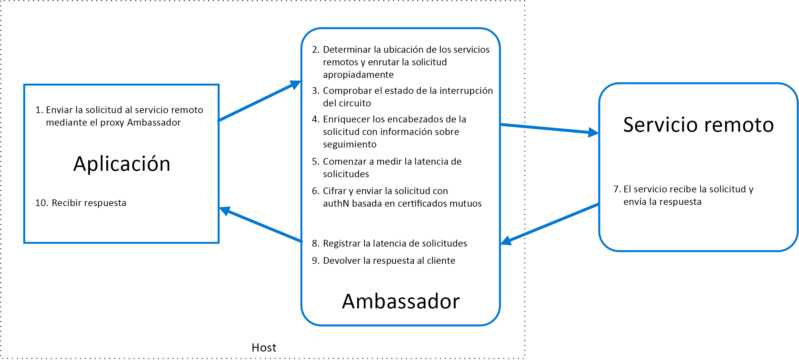

# Patrón Ambassador

Crea servicios de aplicaciones auxiliares que envíen solicitudes de red en nombre de una aplicación o servicio de consumidor. Un servicio de Ambassador puede considerarse como un proxy fuera de proceso que coexiste con el cliente.

Este patrón puede ser útil para la descarga de tareas comunes de conectividad de cliente, como la supervisión, el registro, el enrutamiento, la seguridad (por ejemplo, TLS) y los [patrones de resistencia][resiliency-patterns] de una manera independiente del lenguaje. A menudo se utiliza con aplicaciones heredadas, u otras aplicaciones que son difíciles de modificar, con el fin de ampliar sus capacidades de red. También puede habilitar un equipo especializado para implementar esas características.

## Contexto y problema

Las aplicaciones resistentes basadas en la nube requieren características como [la aplicación de Circuit Breaker][circuit-breaker], el enrutamiento, la medición y la supervisión, así como la capacidad de aplicar actualizaciones de configuración relacionadas con la red. Puede resultar difícil o imposible actualizar aplicaciones heredadas o bibliotecas de código existente para agregar estas características, porque el código ya no se mantiene o no se puede modificar con facilidad por el equipo de desarrollo.

Las llamadas de red también pueden requerir una configuración considerable para la conexión, la autenticación y la autorización. Si estas llamadas se usan en varias aplicaciones, compiladas con varios lenguajes y marcos de trabajo, deben configurarse para cada una de estas instancias. Además, es posible que la funcionalidad de red y seguridad tenga que administrarse por un equipo central dentro de su organización. Con una base de código de gran tamaño, puede ser peligroso para ese equipo actualizar el código de la aplicación con el que no esté familiarizado.

## Solución

Coloque marcos y bibliotecas de cliente en un proceso externo que actúe como un proxy entre la aplicación y los servicios externos. Implemente el proxy en el mismo entorno de host que la aplicación para permitir el control sobre el enrutamiento, la resistencia y las características de seguridad y para evitar las restricciones de acceso relacionadas con el host. También puede usar el patrón Ambassador para normalizar y ampliar la instrumentación. El proxy puede supervisar las métricas de rendimiento como la latencia o el uso de recursos, y esta supervisión se produce en el mismo entorno de host que la aplicación.

Las características que se descargan en Ambassador pueden administrarse independientemente de la aplicación. Puede actualizar y modificar Ambassador sin tener que tocar la funcionalidad heredada de la aplicación. También permite que los equipos independientes y especializados implementen y mantengan las características de seguridad, redes o autenticación que se han movido a Ambassador.

Los servicios de Ambassador pueden implementarse como [Sidecar][sidecar] para acompañar el ciclo de vida de una aplicación o servicio que lo utiliza. O bien, si se comparte un Ambassador mediante varios procesos independientes en un host común, puede implementarse como un demonio o un servicio de Windows. Si el servicio que lo utiliza está en contenedores, el Ambassador debe crearse como un contenedor independiente en el mismo host, con los vínculos correspondientes configurados para la comunicación.

## Problemas y consideraciones

- El proxy agrega cierta sobrecarga de latencia. Considere si una biblioteca de cliente, que se invoca directamente por la aplicación, es un enfoque más adecuado.
- Tenga en cuenta los posibles efectos de incluir características generalizadas en el proxy. Por ejemplo, Ambassador podría controlar los reintentos, pero esto podría no ser seguro (a menos que todas las operaciones sean idempotentes).
- Considere la posibilidad de usar un mecanismo para permitir que el cliente pase algún contexto al proxy, y también que lo devuelva al cliente. Por ejemplo, incluya encabezados de solicitud HTTP para no participar en el reintento o especificar el número máximo de reintentos.
- Piense en cómo empaquetará e implementará el proxy.
- Piense si va a utilizar una sola instancia compartida para todos los clientes o bien una instancia para cada cliente.

## Cuándo usar este patrón

Use este patrón cuando:

- Tenga que crear un conjunto común de características de conectividad de cliente en varios lenguajes o marcos de trabajo.
- Tenga que descargar los problemas de conectividad de cliente transversales en los desarrolladores de infraestructura u otros equipos más especializados.
- Tenga que admitir los requisitos de conectividad del clúster o la nube en una aplicación heredada o una aplicación que sea difícil de modificar.

Este patrón puede no ser adecuado:

- Cuando la latencia de solicitud de red es fundamental. Un proxy introducirá cierta sobrecarga, aunque mínima, y en algunos casos esto puede afectar a la aplicación.
- Cuando se usan características de conectividad de cliente por un solo lenguaje. En ese caso, una mejor opción podría ser una biblioteca de cliente que se distribuya a los equipos de desarrollo como un paquete.
- Cuando las características de conectividad no se pueden generalizar y requieren una integración más profunda con la aplicación cliente.

## Ejemplo

El siguiente diagrama muestra una aplicación que realiza una solicitud a un servicio remoto a través de un proxy de Ambassador. Ambassador proporciona el enrutamiento, la interrupción del circuito y el registro. Llama al servicio remoto y luego devuelve la respuesta a la aplicación cliente:

 

## Instrucciones relacionadas

- [Patrón Sidecar](./sidecar.md)

<!-- links -->

[circuit-breaker]: ./circuit-breaker.md
[resiliency-patterns]: ./category/resiliency.md
[sidecar]: ./sidecar.md
