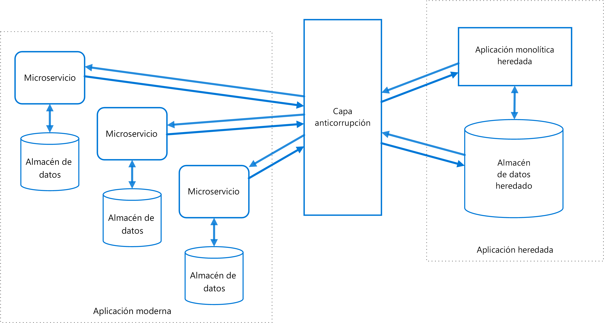

# Patrón Anti-Corruption Layer

Implementa una capa de fachada o de adaptador entre una aplicación moderna y un sistema heredado del que depende. Esta capa traduce solicitudes entre la aplicación moderna y el sistema heredado. Use este patrón para asegurarse de que el diseño de la aplicación no se vea limitado por dependencias de sistemas heredados. Eric Evans describió por primera vez este patrón en *Domain-Driven Design* (Diseño basado en dominios).

## Contexto y problema

La mayoría de las aplicaciones dependen de otros sistemas para obtener determinados datos o funcionalidades. Por ejemplo, cuando se migra una aplicación heredada a un sistema moderno, es posible que siga necesitando recursos heredados existentes. Las nuevas características deben poder llamar al sistema heredado. Esto ocurre especialmente con las migraciones graduales, donde diversas características de una aplicación mayor se trasladan a un sistema moderno con el tiempo.

A menudo estos sistemas heredados experimentan problemas de calidad, como esquemas de datos convolucionados o API obsoletas. Las características y tecnologías que se usan en sistemas heredados pueden variar ampliamente respecto a las empleadas en sistemas más modernos. Para interoperar con el sistema heredado, puede que la nueva aplicación necesite admitir elementos no actualizados, como una infraestructura, protocolos, modelos de datos, API u otras características, que de lo contrario no incluiría en una aplicación moderna.

Mantener el acceso entre sistemas nuevos y heredados puede forzar al nuevo sistema a ajustarse a al menos algunas de las API o a una semántica distinta del sistema heredado. Cuando estas características heredadas tienen problemas de calidad, al admitirlas se "corrompe" lo que, en caso contrario, podría ser una aplicación moderna con un diseño inmaculado. 

## Solución

Aísle los sistemas heredados y modernos mediante la colocación de una capa para evitar daños (Anti-Corruption Layer) entre ellos. Esta capa traduce las comunicaciones entre los dos sistemas, lo que permite al sistema heredado permanecer inalterado mientras la aplicación moderna evita comprometer su diseño y su enfoque tecnológico.

 

La comunicación entre la aplicación moderna y la capa para evitar daños siempre utiliza la arquitectura y el modelo de datos de la aplicación. Las llamadas de la capa para evitar daños al sistema heredado se ajustan al modelo de datos u otros métodos de ese sistema. La capa para evitar daños contiene toda la lógica necesaria para traducir entre los dos sistemas. La capa puede implementarse como un componente dentro de la aplicación o como un servicio independiente.

## Problemas y consideraciones

- La capa para evitar daños puede añadir latencia a las llamadas entre los dos sistemas.
- La capa para evitar daños añade un servicio adicional que debe administrarse y mantenerse.
- Tenga en cuenta cómo se escalará la capa para evitar daños.
- Sopese si va a necesitar más de una capa para evitar daños. Es posible que desee descomponer la funcionalidad en varios servicios con diferentes tecnologías o lenguajes o que, por otros motivos, desee crear particiones de la capa para evitar daños.
- Tenga en cuenta cómo se administrará la capa para evitar daños en relación con sus otras aplicaciones o servicios. ¿Cómo se integrará en sus procesos de supervisión, lanzamiento y configuración?
- Asegúrese de mantener la coherencia de la transacción y los datos y de que se pueda supervisar.
- Tenga en cuenta si será necesario que la capa para evitar daños administre todas las comunicaciones entre el sistema heredado y el moderno o si solo deberá controlar un subconjunto de características. 
- Considere si la capa para evitar daños será permanente o si se retirará más adelante cuando toda la funcionalidad heredada se haya migrado.

## Cuándo usar este patrón

Use este patrón en los siguientes supuestos:

- Se haya planificado una migración en varias fases, pero deba mantenerse la integración entre el sistema nuevo y el heredado.
- El sistema nuevo y el heredado usen una semántica diferente, pero necesiten comunicarse.

Este patrón puede no ser adecuado si no hay ninguna diferencia semántica importante entre el sistema nuevo y el heredado. 

## Instrucciones relacionadas

- [Patrón Strangler][strangler]

[strangler]: ./strangler.md
