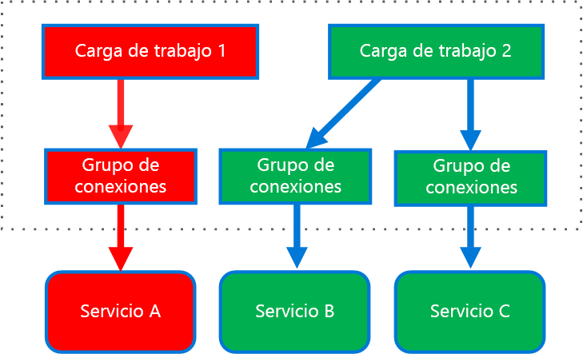
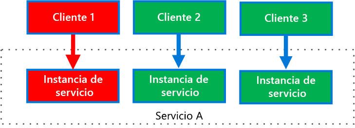

# <a name="bulkhead-pattern"></a>Patrón Bulkhead

Aísle los elementos de una aplicación en grupos para que, si se produce un error en uno, los demás sigan funcionando.

Este patrón se denomina *Bulkhead* porque se parece a las particiones seccionadas del casco de un barco. Si el casco de un barco corre peligro, solo se llenará de agua la sección dañada, lo que evita que el barco se hunda. 

## <a name="context-and-problem"></a>Contexto y problema

Una aplicación basada en la nube puede incluir varios servicios, y cada servicio tiene uno o varios consumidores. Una carga excesiva o un error en un servicio afectarán a todos los consumidores del servicio.

Además, un consumidor puede enviar solicitudes a varios servicios al mismo tiempo y usar recursos para cada solicitud. Cuando el consumidor envía una solicitud a un servicio que no está configurada correctamente o que no responde, es posible que los recursos utilizados por la solicitud del cliente no se liberen en el momento oportuno. Como las solicitudes al servicio no se detienen, pueden agotarse. Por ejemplo, se puede agotar el grupo de conexiones del cliente. En ese momento, las solicitudes que el consumidor realiza a otros servicios resultan afectadas. En último término, el consumidor no puede volver a enviar solicitudes a otros servicios, no solo al servicio original que no responde.

El mismo problema de agotamiento de recursos afecta a los servicios con varios consumidores. Un gran número de solicitudes cuyo origen es un cliente puede agotar los recursos disponibles en el servicio. Otros consumidores no pueden consumir el servicio, lo que provoca un efecto de error en cascada.

## <a name="solution"></a>Solución

Dividir las instancias del servicio en distintos grupos, en función de disponibilidad y carga de los consumidores. Este diseño ayuda a aislar los errores y le permite mantener la funcionalidad del servicio para algunos consumidores, incluso durante un error.

Los consumidores también pueden dividir los recursos, con el fin de asegurarse de que los recursos usados para llamar a un servicio no afectan a los usados para llamar a otro servicio. Por ejemplo, a un consumidor que llama a varios servicios se le puede asignar un grupo de conexiones por cada servicio. Si un servicio empieza a fallar, solo afecta al grupo de conexiones a dicho servicio, lo que permite al consumidor seguir usando los restantes.

Las ventajas de este patrón son:

- Aísla los consumidores y servicios de errores en cascada. Un problema que afecta a un servicio o a un consumidor se puede aislar en su propio mamparo, lo que evita que el error afecte a toda la solución.
- Le permite conservar cierta funcionalidad si se produce un error del servicio. Otros servicios y características de la aplicación continuarán funcionando.
- Permite implementar servicios que ofrecen una calidad de servicio diferente a las aplicaciones consumidoras. Se puede configurar que un grupo de consumidores de alta prioridad use los servicios de alta prioridad. 

El siguiente diagrama muestra mamparos estructurados en torno a grupos de conexiones que llaman a los servicios individuales. Si en Service A se produce algún error o provoca algún otro problema, se aísla el grupo de conexiones, con lo que solo resultan afectadas las cargas de trabajo que usan el grupo de subprocesos asignado a Service A. Las cargas de trabajo que usan Service B y C no resultan afectadas y pueden seguir funcionando sin interrupción.

 

El diagrama siguiente muestra a varios clientes que llaman a un único servicio. A cada cliente se le asigna una instancia de servicio independiente. Client 1 ha realizado demasiadas solicitudes y desborda su instancia. Dado que cada instancia de servicio está aislada de las demás, los restantes clientes pueden seguir haciendo llamadas.


     
## <a name="issues-and-considerations"></a>Problemas y consideraciones

- Defina particiones en torno a los requisitos técnicos y empresariales de la aplicación.
- Al dividir los servicios o los consumidores en mamparos, tenga en cuenta el nivel de aislamiento que ofrece la tecnología, así como la sobrecarga en términos de costo, rendimiento y capacidad de administración.
- Considere la posibilidad de combinar mamparos con los patrones Retry, Circuit Breaker y Throttling para proporcionar un control de errores más sofisticado.
- Al dividir los consumidores en mamparos, considere la posibilidad de usar procesos, grupos de subprocesos y semáforos. Algunos proyectos como [Netflix Hystrix][hystrix] y [Polly][polly] ofrecen un marco para crear mamparos de consumidor.
- Al dividir los servicios en mamparos, considere la posibilidad de implementarlos en máquinas virtuales, contenedores o procesos independientes. Los contenedores ofrecen un buen equilibrio de aislamiento de recursos con poca sobrecarga.
- Los servicios que se comunican mediante mensajes asincrónicos se pueden aislar a través de distintos conjuntos de colas. Cada cola puede tener un conjunto dedicado de mensajes de procesamiento de instancias en la cola o un único grupo de instancias que usa un algoritmo para quitar de la cola y enviar el procesamiento.
- Determine el nivel de granularidad de los mamparos. Por ejemplo, si desea distribuir los inquilinos en particiones, puede colocar cada uno de ellos en una partición independiente o colocar varios inquilinos en una única partición.
- Supervise el rendimiento y el Acuerdo de Nivel de Servicio de cada partición.

## <a name="when-to-use-this-pattern"></a>Cuándo usar este patrón

Este patrón se usa para:

- Aislar los recursos que se usan para consumir un conjunto de servicios back-end, sobre todo si la aplicación puede proporcionar cierto nivel de funcionalidad, aunque no responda uno de los servicios.
- Aislar los consumidores críticos de los consumidores estándares.
- Proteger la aplicación de errores en cascada.

Este patrón puede no ser adecuado cuando:

- Puede que no se acepte un uso menos eficaz de los recursos en el proyecto.
- La complejidad agregada no es necesaria

## <a name="example"></a>Ejemplo

El siguiente archivo de configuración de Kubernetes crea un contenedor aislado que ejecuta un servicio individual, con sus propios recursos y límites de CPU y memoria.

```yml
apiVersion: v1
kind: Pod
metadata:
  name: drone-management
spec:
  containers:
  - name: drone-management-container
    image: drone-service
    resources:
      requests:
        memory: "64Mi"
        cpu: "250m"
      limits:
        memory: "128Mi"
        cpu: "1"
```

## <a name="related-guidance"></a>Instrucciones relacionadas

- [Circuit Breaker pattern](./circuit-breaker.md) (Patrón Circuit Breaker)
- [Diseño de aplicaciones resistentes de Azure](../resiliency/index.md)
- [Retry pattern](./retry.md) (Patrón Retry)
- [Throttling pattern](./throttling.md) (Patrón Throttling)


<!-- links -->

[hystrix]: https://github.com/Netflix/Hystrix
[polly]: https://github.com/App-vNext/Polly