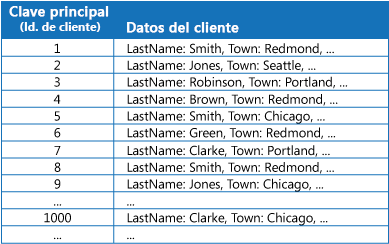
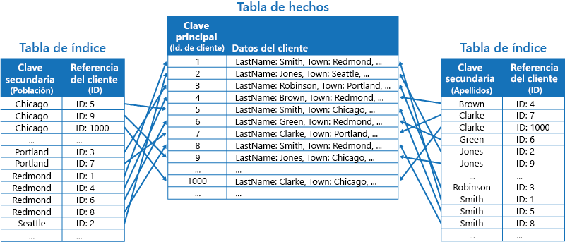
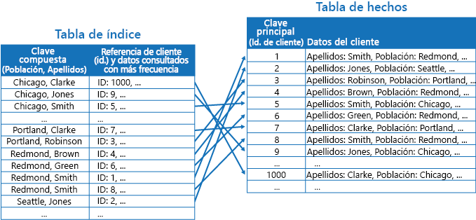
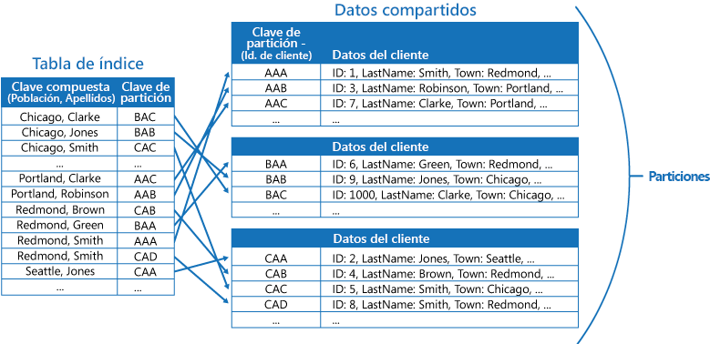
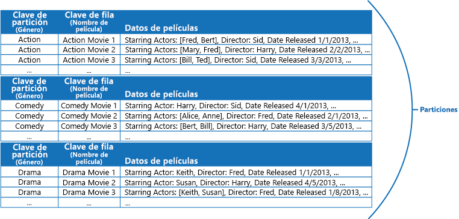
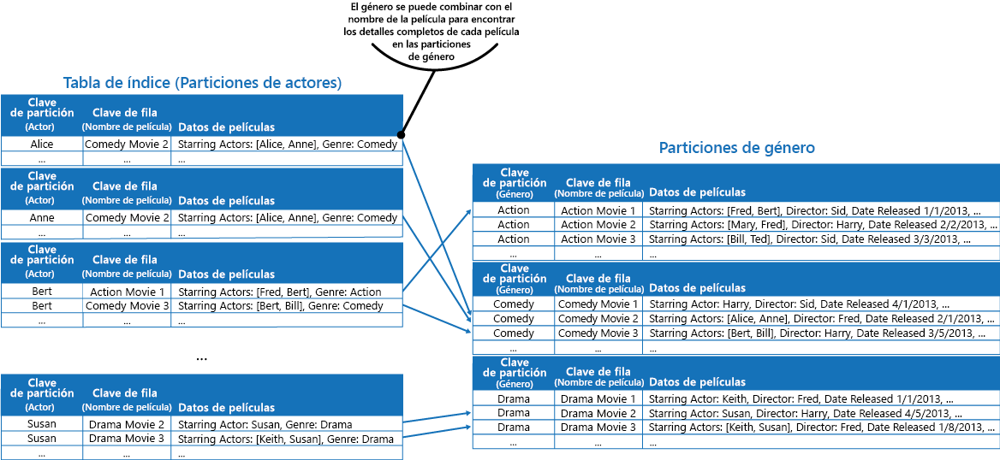

# Patrón Index Table

[!INCLUDE [header](../_includes/header.md)]

Crea índices en los campos de los almacenes de datos a los que suelen hacer referencia las consultas. Este patrón puede mejorar el rendimiento de las consultas permitiendo a las aplicaciones localizar más rápidamente los datos a recuperar desde un almacén de datos.

## Contexto y problema

Muchos almacenes de datos organizan los datos de una colección de entidades mediante la clave principal. Una aplicación puede usar esta clave para buscar y recuperar datos. La ilustración muestra un ejemplo de un almacén de datos que contiene información del cliente. La clave principal es el identificador del cliente. La ilustración muestra la información del cliente organizada por la clave principal (identificador del cliente).

Aunque la clave principal es útil para consultas que capturan datos basados en el valor de esta clave, es posible que una aplicación no pueda usarla si necesita recuperar datos basados en algún otro campo. En el ejemplo de los clientes, una aplicación no puede usar la clave principal de identificador del cliente para recuperar clientes si consulta los datos haciendo referencia únicamente al valor de algún otro atributo, como la ciudad en la que está ubicado el cliente. Para realizar una consulta como esta, puede que la aplicación tenga que capturar y examinar todos los registros de los clientes, lo cual podría ser un proceso lento.

Muchos sistemas de administración de bases de datos relacionales admiten índices secundarios. Un índice secundario es una estructura de datos independiente que se organiza por uno o varios campos clave no principales (secundarios), y que indica dónde se almacenan los datos de cada valor indexado. Normalmente, los elementos de un índice secundario se ordenan por el valor de las claves secundarias lo cual permite unas búsquedas rápidas de datos. Normalmente, el sistema de administración de bases de datos es el encargado de mantener automáticamente estos índices.

Puede crear tantos índices secundarios como sea necesario para admitir las distintas consultas que realiza la aplicación. Por ejemplo, en una tabla de clientes de una base de datos relacional en la que el identificador de cliente es la clave principal, es útil agregar un índice secundario con el campo de ciudad si la aplicación busca con frecuencia clientes por la ciudad en la que residen.

Sin embargo, aunque los índices secundarios son habituales en los sistemas relacionales, la mayoría de los almacenes de datos NoSQL utilizados por aplicaciones en la nube no proporcionan ninguna característica equivalente.

## Solución

Si el almacén de datos no admite índices secundarios, puede emularlos manualmente mediante la creación de sus propias tablas de índice. Una tabla de índice organiza los datos mediante una clave especificada. Normalmente se usan tres estrategias para estructurar una tabla de índice, dependiendo del número de índices secundarios que sean necesarios y la naturaleza de las consultas que realiza una aplicación.

La primera estrategia consiste en duplicar los datos de cada tabla de índice pero organizándola por claves diferentes (desnormalización completa). En la ilustración siguiente se muestran las tablas de índice que organizan la misma información del cliente por ciudad y apellido.

Esta estrategia es adecuada si los datos son relativamente estáticos en comparación con el número de veces que se consulta mediante cada clave. Si los datos son más dinámicos, la sobrecarga de procesamiento que supone mantener cada tabla de índice resulta demasiado grande para que este enfoque sea útil. Además, si el volumen de datos es muy grande, la cantidad de espacio necesario para almacenar los datos duplicados es significativa.

La segunda estrategia consiste en crear tablas de índice normalizadas organizadas por diferentes claves y hacer referencia a los datos originales mediante la clave principal en lugar de duplicarla, como se indica en la siguiente ilustración. Los datos originales se denominan tabla de hechos.

Esta técnica ahorra espacio y reduce la sobrecarga que supone mantener los datos duplicados. La desventaja es que una aplicación tiene que realizar dos operaciones de búsqueda para buscar datos mediante una clave secundaria. Debe buscar la clave principal de los datos de la tabla de índice y, después, usar la clave principal para buscar los datos en la tabla de hechos.

La tercera estrategia consiste en crear tablas de índices parcialmente normalizadas y organizadas por claves diferentes que duplican los campos que se recuperan con frecuencia. Haga referencia a la tabla de hechos para acceder a los campos a los que se accede con menos frecuencia. La siguiente ilustración muestra cómo se duplican los datos a los que se accede habitualmente en cada tabla de índice.

Con esta estrategia, puede lograr un equilibrio entre los dos primeros enfoques. Los datos de las consultas habituales se pueden recuperar rápidamente mediante una sola búsqueda, mientras que la sobrecarga de espacio y de mantenimiento no es tan significativa como la que se produce al duplicar todo el conjunto de datos.

Si una aplicación realiza consultas frecuentes de datos mediante la especificación de una combinación de valores (por ejemplo, "Buscar todos los clientes que viven en Redmond y que tienen el apellido Smith"), puede implementar las claves para los elementos de la tabla de índice como una concatenación del atributo Town y del atributo LastName. La ilustración siguiente muestra una tabla de índice basada en claves compuestas. Las claves se ordenan por ciudad, y luego por apellidos en el caso de aquellos registros que tienen el mismo valor para la ciudad.

Las tablas de índice pueden acelerar las operaciones de consulta en datos con particiones y son especialmente útiles en los casos en los que a la clave de partición se le aplica un algoritmo hash. En la ilustración siguiente se muestra un ejemplo en el que la clave de partición es un hash del identificador de cliente. La tabla de índice puede organizar los datos por el valor al que no se ha aplicado el algoritmo hash (Town y LastName) y proporcionar la clave de partición con hash como los datos de búsqueda. Esto puede ahorrar a la aplicación el tener que calcular repetidamente las claves hash (una operación costosa) si necesita recuperar los datos que se encuentran dentro de un intervalo, o si necesita capturar datos para la clave sin algoritmo hash. Por ejemplo, una consulta como "Buscar todos los clientes que viven en Redmond" se puede resolver rápidamente localizando los elementos coincidentes en la tabla de índice, en la que están todos almacenados en un bloque contiguo. Después, siga las referencias a los datos del cliente mediante las claves de partición almacenadas en la tabla de índice.

## Problemas y consideraciones

Tenga en cuenta los puntos siguientes al decidir cómo implementar este patrón:

- La sobrecarga que supone el mantenimiento de índices secundarios puede ser importante. Debe analizar y comprender las consultas que usa la aplicación. Solo puede crear tablas de índice cuando es probable que se utilicen con frecuencia. No cree tablas de índice especulativas que admitan consultas que una aplicación no realiza, o que realiza solo de forma ocasional.
- Duplicar datos en una tabla de índice puede agregar una sobrecarga significativa en los costos de almacenamiento y en el esfuerzo necesario para mantener varias copias de datos.
- La implementación de una tabla de índice como una estructura normalizada que hace referencia a los datos originales necesita una aplicación para realizar dos operaciones de búsqueda para encontrar los datos. La primera operación busca la tabla de índice para recuperar la clave principal, y la segunda usa la clave principal para capturar los datos.
- Si un sistema incorpora varias tablas de índice de conjuntos de datos muy grandes, puede que sea difícil mantener la coherencia entre las tablas de índice y los datos originales. Es posible diseñar la aplicación basándose en el modelo de coherencia final. Por ejemplo, para insertar, actualizar o eliminar datos, una aplicación podría enviar un mensaje a una cola y permitir que una tarea independiente realice la operación y mantenga las tablas de índice que hacen referencia a estos datos de forma asincrónica. Para más información acerca de la implementación de la coherencia final, consulte [Data consistency primer](https://msdn.microsoft.com/library/dn589800.aspx)(Manual básico de coherencia de datos).

   >  Las tablas de almacenamiento de Microsoft Azure admiten actualizaciones transaccionales de los cambios realizados en los datos contenidos en la misma partición (denominadas transacciones de grupos de entidades). Si puede almacenar los datos de una tabla de hechos y una o varias tablas de índice en la misma partición, puede utilizar esta característica para ayudar a garantizar la coherencia.

- Las tablas de índice se pueden particionar por sí mismas.

## Cuándo usar este patrón

Use este patrón para mejorar el rendimiento de las consultas si una aplicación necesita con frecuencia recuperar datos mediante una clave distinta de la clave (o partición) principal.

Este modelo podría no ser útil en las situaciones siguientes:

- Los datos son volátiles. Una tabla de índice puede quedar desactualizada muy rápidamente, lo cual hace que resulte ineficaz o que la sobrecarga que supone mantener la tabla de índice sea mayor que cualquier ahorro que se pueda conseguir mediante su uso.
- Un campo seleccionado como clave secundaria para una tabla de índice no discrimina y solo puede tener un pequeño conjunto de valores (por ejemplo, el género).
- El equilibrio de los valores de datos de un campo seleccionado como clave secundaria para una tabla de índice no está muy sesgado. Por ejemplo, si el 90 % de los registros contienen el mismo valor en un campo, crear y mantener una tabla de índice para buscar datos basados en este campo puede que cree más sobrecarga que un examen de los datos de forma secuencial. Sin embargo, si las consultas se realizan con mucha frecuencia sobre valores que se encuentran en el 10 % restante, este índice podría resultar útil. Debe comprender las consultas que realiza la aplicación y con qué frecuencia las hace.

## Ejemplo

Las tablas de Azure Storage proporcionan un almacén de datos clave/valor, altamente escalable, para las aplicaciones que se ejecutan en la nube. Las aplicaciones almacenan y recuperan valores de datos especificando una clave. Los valores de datos pueden contener varios campos, pero la estructura de un elemento de datos es opaca para el almacenamiento de tablas, que simplemente controla un elemento de datos como una matriz de bytes.

Las tablas de Azure Storage también admiten particionamiento. La clave de particionamiento incluye dos elementos, una clave de partición y una clave de fila. Los elementos que tienen la misma clave de partición se almacenan en la misma partición y los elementos se almacenan por orden según la clave de fila dentro de una partición. El almacenamiento de tablas está optimizado para realizar consultas que capturan datos incluidos en un intervalo contiguo de valores de clave de fila que se encuentran dentro de una partición. Si va a compilar aplicaciones en la nube que almacenan información en tablas de Azure, debe estructurar los datos con esta característica en mente.

Por ejemplo, piense en una aplicación que almacena información acerca de películas. La aplicación realiza consultas frecuentes sobre películas por género (acción, documental, histórica, comedia, serie, etc). Puede crear una tabla de Azure con particiones para cada género usando este como clave de partición y especificando el nombre de la película como la clave de fila, tal y como se indica en la siguiente ilustración.

Este enfoque es menos efectivo si la aplicación también necesita consultar películas por el actor principal. En este caso, puede crear una tabla independiente de Azure que actúa como una tabla de índice. La clave de partición es el actor y la clave de fila es el nombre de la película. Los datos de cada actor se almacenan en particiones independientes. Si una película tiene más de un protagonista, la misma película aparecerá en varias particiones.

Puede duplicar los datos de la película en los valores mantenidos en cada partición mediante el primer enfoque descrito en la sección anterior de soluciones. Sin embargo, es probable que cada película se replique varias veces (una vez por cada actor), por lo que podría resultar más eficaz desnormalizar parcialmente los datos para admitir las consultas más habituales (por ejemplo, los nombres de los otros actores) y habilitar una aplicación para recuperar los restantes detalles mediante la inclusión de la clave de partición necesaria para buscar la información completa en las particiones por género. Este enfoque se describe en la tercera opción de la sección de soluciones. La ilustración siguiente muestra este enfoque.

## Orientación y patrones relacionados

Los patrones y las directrices siguientes también pueden ser importantes a la hora de implementar este modelo:

- [Data Consistency Primer](https://msdn.microsoft.com/library/dn589800.aspx) (Manual básico de coherencia de datos). Una tabla de índice se debe mantener a medida que cambian los datos que indexa. En la nube, puede que no sea posible ni adecuado realizar operaciones que actualicen un índice como parte de la misma transacción que modifica los datos. En ese caso, un enfoque con coherencia final es más adecuado. Proporciona información sobre los problemas que pueden surgir con la coherencia final.
- [Sharding pattern](https://msdn.microsoft.com/library/dn589797.aspx) (Patrón de particionamiento). El patrón de tabla de índice se utiliza con frecuencia junto con datos con particiones mediante el uso de particiones. El patrón Sharding proporciona más información acerca de cómo dividir un almacén de datos en un conjunto de particiones.
- [Patrón Materialized View](materialized-view.md). En lugar de indexar los datos para admitir consultas que resuman los datos, puede ser más adecuado crear una vista materializada de estos. Describe cómo admitir consultas de resumen eficaces mediante la generación de vistas rellenadas previamente con datos.
