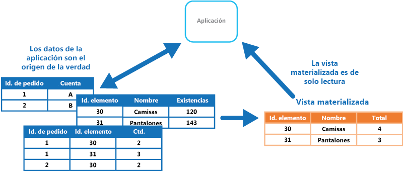
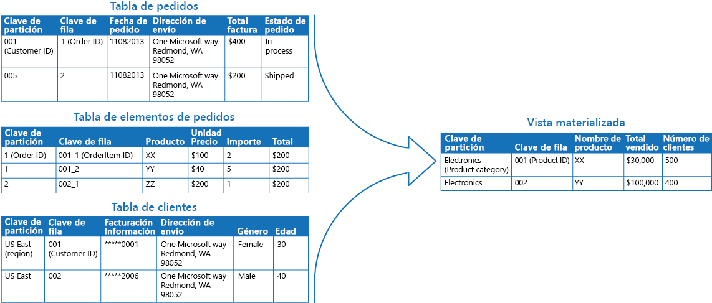

# Patrón Materialized View

[!INCLUDE [header](../_includes/header.md)]

Genera vistas rellenadas previamente de los datos en uno o más almacenes de datos cuando los datos no tienen el formato idóneo para las operaciones de consulta requeridas. Esto puede contribuir a que la realización de consultas y la extracción de los datos se lleven a cabo de manera eficaz, y a la mejora del rendimiento de la aplicación.

## Contexto y problema

Al almacenar datos, la prioridad de los desarrolladores y administradores de datos se centra con frecuencia en cómo se almacenan los datos, y no tanto en cómo se leen. El formato de almacenamiento elegido suele estar estrechamente relacionado con el formato de los datos, los requisitos de administración del tamaño y la integridad de los datos, y la clase de almacén que se utiliza. Por ejemplo, cuando se usa el almacén de documentos NoSQL, los datos se suelen representar como una serie de agregados, que contiene cada uno toda la información de esa entidad.

Sin embargo, esto puede tener un impacto negativo sobre las consultas. Cuando una consulta solo necesita un subconjunto de los datos de algunas entidades, como un resumen de pedidos de varios clientes sin todos los detalles de los pedidos, se deben extraer todos los datos de las entidades pertinentes con el fin de obtener la información necesaria.

## Solución

Para permitir la realización eficaz de consultas, una solución común es generar por adelantado una vista que materialice los datos en un formato adecuado para el conjunto de resultados en cuestión. El patrón Materialized View describe la generación de vistas de datos previamente rellenadas en entornos en los que los datos de origen no se encuentran en un formato adecuado para consulta, donde la generación de una consulta adecuada es difícil o donde el rendimiento de las consultas es deficiente debido a la naturaleza de los datos o el almacén de datos.

Estas vistas materializadas, que solo contienen los datos que requiere la consulta, permiten que las aplicaciones obtengan rápidamente la información que necesitan. Además de combinar tablas o combinar entidades de datos, las vistas materializadas pueden incluir los valores actuales de columnas calculadas o elementos de datos, los resultados de combinar valores o de ejecutar transformaciones sobre los elementos de datos y los valores especificados como parte de la consulta. Una vista materializada se puede optimizar incluso para una única consulta.

Un aspecto clave es que una vista materializada, y los datos que contiene, son completamente desechables porque se pueden volver a generar por completo a partir de los almacenes de datos de origen. Una vista materializada nunca se actualiza directamente mediante una aplicación y, por tanto, es una caché especializada.

Cuando cambian los datos de origen de la vista, esta debe actualizarse para incluir la nueva información. Puede programar que la actualización suceda automáticamente o cuando el sistema detecte un cambio en los datos originales. En algunos casos podría ser necesario volver a generar la vista manualmente. En la ilustración se muestra un ejemplo de cómo se podría utilizar el patrón Materialized View.

## Problemas y consideraciones

Tenga en cuenta los puntos siguientes al decidir cómo implementar este patrón:

Cómo y cuándo se actualizará la vista. Lo mejor es que se regenere en respuesta a un evento que indique un cambio en los datos de origen, aunque esto pueda conducir a una sobrecarga excesiva si los datos de origen cambian rápidamente. Otra alternativa es usar una tarea programada, un desencadenador externo o una acción manual para regenerar la vista.

En algunos sistemas, como cuando se usa un patrón Event Sourcing para mantener un almacén solo de los eventos que modificaron los datos, se necesitan vistas materializadas. La única manera de obtener información del almacén de eventos es rellenar previamente las vistas y examinar todos los eventos para determinar el estado actual. Si no va a usar Event Sourcing, debe considerar si una vista materializada es útil o no. Las vistas materializadas tienden a adaptarse específicamente a una consulta o a un pequeño número de consultas. Si se usan muchas consultas, las vistas materializadas pueden dar lugar a requisitos de costos y capacidad de almacenamiento inaceptables.

Tenga en cuenta el impacto sobre la coherencia de los datos al generar la vista y al actualizarla si esto se produce según una programación. Si el origen de los datos cambia en el punto en el que se genera la vista, la copia de los datos de la vista no será completamente coherente con los datos originales.

Piense en dónde almacenar la vista. La vista no tiene que estar ubicada en el mismo almacén o la misma partición que los datos originales. Puede ser un subconjunto de unas cuantas particiones diferentes combinadas.

Una vista se puede regenerar en caso de pérdida. Debido a ello, si la vista es transitoria y solo se usa para mejorar el rendimiento de las consultas y reflejar el estado actual de los datos, o para mejorar la escalabilidad, se puede almacenar en una caché o en una ubicación menos confiable.

Al definir una vista materializada, aumente su valor agregándole elementos de datos o columnas en función del cálculo o la transformación de los elementos de datos existentes, de los valores pasados a la consulta o de combinaciones de estos valores cuando sea adecuado.

Si el mecanismo de almacenamiento lo admite, considere la posibilidad de indexar la vista materializada para mejorar el rendimiento. La mayoría de bases de datos relacionales admiten la indexación de las vistas, así como soluciones de macrodatos basadas en Apache Hadoop.

## Cuándo usar este patrón

Este patrón es útil en los siguientes escenarios:
- Para crear vistas materializadas sobre datos que sean difíciles de consultar directamente, o cuando las consultas tengan que ser muy complejas para extraer datos que están almacenados de una manera normalizada, parcialmente estructurada o no estructurada.
- Para crear vistas temporales que puedan mejorar extraordinariamente el rendimiento de las consultas o que puedan actuar directamente como vistas de origen u objetos de transferencia de datos para la interfaz de usuario, para la generación de informes o para la visualización.
- Para permitir ocasionalmente escenarios conectados o desconectados donde la conexión al almacén de datos no siempre se encuentre disponible. En este caso, la vista puede almacenarse en caché localmente.
- Para simplificar las consultas y exponer los datos para la experimentación de forma que no sea necesario conocer el formato de los datos de origen. Por ejemplo, combinar diferentes tablas en una o varias bases de datos, o en uno o varios dominios de almacenes NoSQL, y luego aplicar formato a los datos para adaptarlos a su uso final.
- Para proporcionar acceso a subconjuntos específicos de los datos de origen que, por motivos de seguridad o privacidad, no deben estar accesibles, abiertos a modificaciones o completamente expuestos a los usuarios, con carácter general.
- Para tender un puente entre almacenes de datos diferentes y aprovechar sus funcionalidades individuales. Por ejemplo, usar un almacén en la nube que sea eficaz para escribir como almacén de datos de referencia y una base de datos relacional que ofrezca un buen rendimiento de lectura y consulta para que contenga las vistas materializadas.

Este patrón no es útil en las situaciones siguientes:
- Los datos de origen son sencillos y fáciles de consultar.
- Los datos de origen cambian muy rápidamente o es posible acceder a ellos sin usar una vista. En estos casos, debe evitar la sobrecarga del procesamiento de creación de vistas.
- La coherencia tiene una prioridad alta. Las vistas podrían no ser siempre completamente coherentes con los datos originales.

## Ejemplo

En la siguiente ilustración se muestra un ejemplo de uso del patrón Materialized View para generar un resumen de ventas. Los datos de las tablas Order, OrderItem y Customer que se encuentran en distintas particiones en una cuenta de almacenamiento de Azure se combinan para generar una vista que contiene el valor de ventas total de cada producto de la categoría Electronics, junto con un recuento del número de clientes que compró cada artículo.

La creación de esta vista materializada requiere consultas complejas. Sin embargo, al exponer el resultado de la consulta como una vista materializada, los usuarios pueden obtener fácilmente los resultados y usarlos directamente o incorporarlos en otra consulta. Es probable que la vista se use como sistema o panel de informes, y se puede actualizar según una programación, por ejemplo, todas las semanas.

>  Aunque en este ejemplo se usa Azure Table Storage, muchos sistemas de administración de bases de datos relacionales también proporcionan compatibilidad nativa con vistas materializadas.

## Orientación y patrones relacionados

Los patrones y las directrices siguientes también pueden ser importantes a la hora de implementar este modelo:
- [Data Consistency Primer](https://msdn.microsoft.com/library/dn589800.aspx) (Manual básico de coherencia de datos). La información de resumen en una vista materializada debe mantenerse para que refleje los valores de datos subyacentes. A medida que cambian los valores de los datos, puede que no resulte práctico actualizar los datos de resumen en tiempo real y, en lugar de ello, adoptar un enfoque de coherencia definitiva. Resume los problemas en torno al mantenimiento de la coherencia sobre los datos distribuidos y describe las ventajas e inconvenientes de los diferentes modelos de coherencia.
- [Patrón Command and Query Responsibility Segregation (CQRS)](cqrs.md). Use este patrón para actualizar la información de una vista materializada mediante la respuesta a los eventos que se producen cuando cambian los valores de los datos subyacentes.
- [Patrón Event Sourcing](event-sourcing.md). Use este patrón en combinación con el patrón CQRS para mantener la información de una vista materializada. Cuando cambian los valores de datos en los que se basa una vista materializada, el sistema puede generar eventos que describen estos cambios y guardarlos en un almacén de eventos.
- [Patrón Index Table](index-table.md). Normalmente, los datos de una vista materializada se organizan mediante una clave principal, pero puede que las consultas tengan que recuperar información de esta vista examinando los datos de otros campos. Use este patrón para crear índices secundarios sobre conjuntos de datos de almacenes de datos que no admiten índices secundarios nativos.
