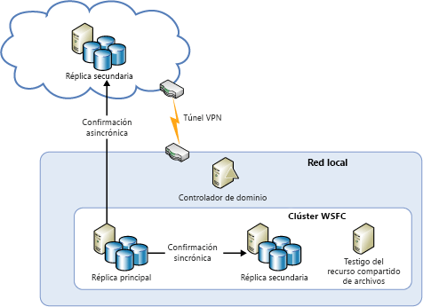
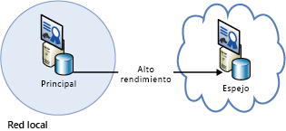
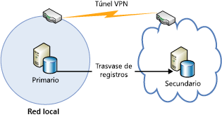
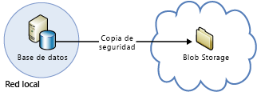

[!INCLUDE [header](../_includes/header.md)]
# Guía técnica sobre resistencia en Azure: recuperación desde un centro de datos local a AzureAzure resiliency technical guidance: Recovery from on-premises to Azure
Azure proporciona un completo conjunto de servicios para habilitar la extensión de un centro de datos local a Azure con fines de alta disponibilidad y recuperación ante desastres:Azure provides a comprehensive set of services for enabling the extension of an on-premises datacenter to Azure for high availability and disaster recovery purposes:

* **Redes**: con una red privada virtual puede ampliar de forma segura la red local en la nube.**Networking**: With a virtual private network, you securely extend your on-premises network to the cloud.
* **Proceso**: los clientes que usan Hyper-V en local pueden "levantar y mover" las máquinas virtuales existentes a Azure.**Compute**: Customers using Hyper-V on-premises can “lift and shift” existing virtual machines (VMs) to Azure.
* **Almacenamiento**: StorSimple extiende el sistema de archivos a Azure Storage.**Storage**: StorSimple extends your file system to Azure Storage. El servicio Azure Backup proporciona copias de seguridad de los archivos y Bases de datos SQL de Azure en Azure Storage.The Azure Backup service provides backup for files and SQL databases to Azure Storage.
* **Replicación de base de datos**: con los grupos de disponibilidad de SQL Server 2014 (o posterior) puede implementar las características de alta disponibilidad y de recuperación ante desastres para los datos locales.**Database replication**: With SQL Server 2014 (or later) Availability Groups, you can implement high availability and disaster recovery for your on-premises data.

## RedesNetworking
Puede usar Azure Virtual Network para crear una sección aislada lógicamente en Azure y conectarla de forma segura al centro de datos local o a un único equipo cliente mediante una conexión IPsec.You can use Azure Virtual Network to create a logically isolated section in Azure and securely connect it to your on-premises datacenter or a single client machine by using an IPsec connection. Con Virtual Network puede sacarle todo el partido a la infraestructura escalable a petición de Azure, sin dejar de ofrecer conectividad a los datos y aplicaciones locales, incluidos los sistemas que se ejecutan en Windows Server, en grandes sistemas y en UNIX.With Virtual Network, you can take advantage of the scalable, on-demand infrastructure in Azure while providing connectivity to data and applications on-premises, including systems running on Windows Server, mainframes, and UNIX. Para más información, consulte la [documentación de redes de Azure](/azure/virtual-network/virtual-networks-overview/) .See [Azure networking documentation](/azure/virtual-network/virtual-networks-overview/) for more information.

## ProcesoCompute
Si está utilizando Hyper-V de forma local puede "levantar y mover" las máquinas virtuales existentes a Azure junto con los proveedores de servicios que ejecutan Windows Server 2012 (o posterior), sin realizar cambios en la máquina virtual ni convertir sus formatos.If you're using Hyper-V on-premises, you can “lift and shift” existing virtual machines to Azure and service providers running Windows Server 2012 (or later), without making changes to the VM or converting VM formats. Para obtener más información, consulte [Acerca de los discos y los discos duros virtuales para máquinas virtuales de Azure](/azure/virtual-machines/virtual-machines-linux-about-disks-vhds/?toc=%2fazure%2fvirtual-machines%2flinux%2ftoc.json).For more information, see [About disks and VHDs for Azure virtual machines](/azure/virtual-machines/virtual-machines-linux-about-disks-vhds/?toc=%2fazure%2fvirtual-machines%2flinux%2ftoc.json).

## Azure Site RecoveryAzure Site Recovery
Si desea obtener la recuperación ante desastres como servicio (DRaaS), Azure proporciona [Azure Site Recovery](https://azure.microsoft.com/services/site-recovery/).If you want disaster recovery as a service (DRaaS), Azure provides [Azure Site Recovery](https://azure.microsoft.com/services/site-recovery/). Azure Site Recovery ofrece protección completa para servidores de VMware, Hyper-V y físicos.Azure Site Recovery offers comprehensive protection for VMware, Hyper-V, and physical servers. Con Azure Site Recovery puede utilizar otro servidor local o el mismo Azure como sitio de recuperación.With Azure Site Recovery, you can use another on-premises server or Azure as your recovery site. Para más información sobre Azure Site Recovery, consulte la [Documentación de Azure Site Recovery](https://azure.microsoft.com/documentation/services/site-recovery/).For more information on Azure Site Recovery, see the [Azure Site Recovery documentation](https://azure.microsoft.com/documentation/services/site-recovery/).

## StorageStorage
Hay varias opciones para usar Azure como sitio de copia de seguridad para los datos locales.There are several options for using Azure as a backup site for on-premises data.

### StorSimpleStorSimple
StorSimple integra de forma segura y transparente el almacenamiento en la nube para las aplicaciones locales.StorSimple securely and transparently integrates cloud storage for on-premises applications. También ofrece un único dispositivo que proporciona almacenamiento local en capas de alto rendimiento y almacenamiento en la nube, archivado activo, protección de datos basada en la nube y recuperación ante desastres.It also offers a single appliance that delivers high-performance tiered local and cloud storage, live archiving, cloud-based data protection, and disaster recovery. Para más información, consulte la [página de productos de StorSimple](https://azure.microsoft.com/services/storsimple/).For more information, see the [StorSimple product page](https://azure.microsoft.com/services/storsimple/).

### Azure BackupAzure Backup
Azure Backup permite las copias de seguridad en la nube mediante las conocidas herramientas de copia de seguridad de Windows Server 2012 (o posterior), Windows Server 2012 Essentials (o posterior) y System Center 2012 Data Protection Manager (o posterior).Azure Backup enables cloud backups by using the familiar backup tools in Windows Server 2012 (or later), Windows Server 2012 Essentials (or later), and System Center 2012 Data Protection Manager (or later). Estas herramientas proporcionan un flujo de trabajo para la administración de copias de seguridad que es independiente de la ubicación de almacenamiento de estas, ya se trate de un disco local o de Azure Storage.These tools provide a workflow for backup management that is independent of the storage location of the backups, whether a local disk or Azure Storage. Una vez que se realiza la copia de seguridad de los datos en la nube, los usuarios autorizados pueden recuperar fácilmente copias de seguridad en cualquier servidor.After data is backed up to the cloud, authorized users can easily recover backups to any server.

Con las copias de seguridad incrementales, solo se transfieren a la nube los cambios en los archivos.With incremental backups, only changes to files are transferred to the cloud. Esto permite usar eficazmente el espacio de almacenamiento, reducir el consumo del ancho de banda y admitir la recuperación de estados anteriores de varias versiones de los datos.This helps to efficiently use storage space, reduce bandwidth consumption, and support point-in-time recovery of multiple versions of the data. También puede usar características adicionales, como las directivas de retención de datos, la compresión de datos y la limitación de la transferencia de datos.You can also choose to use additional features, such as data retention policies, data compression, and data transfer throttling. El uso de Azure como ubicación de las copias de seguridad tiene la ventaja obvia de que las copias de seguridad están automáticamente en una ubicación remota.Using Azure as the backup location has the obvious advantage that the backups are automatically “offsite”. Esto elimina los requisitos adicionales para proteger los medios de copia de seguridad in situ.This eliminates the extra requirements to secure and protect on-site backup media.

Para obtener más información, consulte [¿Qué es Azure Backup?](/azure/backup/backup-introduction-to-azure-backup/) y [Configuración de Azure Backup para los datos DPM](https://technet.microsoft.com/library/jj728752.aspx).For more information, see [What is Azure Backup?](/azure/backup/backup-introduction-to-azure-backup/) and [Configure Azure Backup for DPM data](https://technet.microsoft.com/library/jj728752.aspx).

## Base de datosDatabase
Puede tener una solución de recuperación ante desastres para las bases de datos de SQL Server en un entorno de TI híbrida usando grupos de disponibilidad AlwaysOn, creación de reflejo de base de datos, trasvase de registros y copias de seguridad y restauración con el Almacenamiento de blobs de Azure.You can have a disaster recovery solution for your SQL Server databases in a hybrid-IT environment by using AlwaysOn Availability Groups, database mirroring, log shipping, and backup and restore with Azure Blob storage. Todas estas soluciones utilizan SQL Server que se ejecuta en Azure Virtual Machines.All of these solutions use SQL Server running on Azure Virtual Machines.

Los grupos de disponibilidad AlwaysOn pueden utilizarse en un entorno de TI híbrida donde las réplicas de la base de datos existen tanto de forma local como en la nube.AlwaysOn Availability Groups can be used in a hybrid-IT environment where database replicas exist both on-premises and in the cloud. Esto se muestra en el diagrama siguiente.This is shown in the following diagram.

La creación de reflejo de base de datos también puede abarcar servidores locales y en la nube en una instalación basada en certificados.Database mirroring can also span on-premises servers and the cloud in a certificate-based setup. En el siguiente diagrama, se ilustra este concepto.The following diagram illustrates this concept.

El trasvase de registros se puede usar para sincronizar una base de datos local con una base de datos de SQL Server en una máquina virtual de Azure.Log shipping can be used to synchronize an on-premises database with a SQL Server database in an Azure virtual machine.

Por último, puede hacer una copia de una base de datos local directamente en Almacenamiento de blobs de Azure.Finally, you can back up an on-premises database directly to Azure Blob storage.

Para obtener más información, consulte [Alta disponibilidad y recuperación ante desastres para SQL Server en Azure Virtual Machines](/azure/virtual-machines/windows/sql/virtual-machines-windows-sql-high-availability-dr/) y [Copias de seguridad y restauración para SQL Server en Azure Virtual Machines](/azure/virtual-machines/windows/sql/virtual-machines-windows-sql-backup-recovery/).For more information, see [High availability and disaster recovery for SQL Server in Azure virtual machines](/azure/virtual-machines/windows/sql/virtual-machines-windows-sql-high-availability-dr/) and [Backup and restore for SQL Server in Azure virtual machines](/azure/virtual-machines/windows/sql/virtual-machines-windows-sql-backup-recovery/).

## Listas de comprobación para la recuperación local en Microsoft AzureChecklists for on-premises recovery in Microsoft Azure
### RedesNetworking
1. Revise la sección Redes de este documento.Review the Networking section of this document.
2. Use la red virtual para conectar de forma segura la ubicación local a la nube.Use Virtual Network to securely connect on-premises to the cloud.

### ProcesoCompute
1. Revise la sección Proceso de este documento.Review the Compute section of this document.
2. Reubique las máquinas virtuales entre Hyper-V y Azure.Relocate VMs between Hyper-V and Azure.

### StorageStorage
1. Revise la sección Almacenamiento de este documento.Review the Storage section of this document.
2. Aproveche las ventajas de los servicios de StorSimple para usar el almacenamiento en la nube.Take advantage of StorSimple services for using cloud storage.
3. Use los servicios de Azure Backup.Use the Azure Backup service.

### Base de datosDatabase
1. Revise la sección Base de datos de este documento.Review the Database section of this document.
2. Considere la posibilidad de usar SQL Server en máquinas virtuales de Azure como copia de seguridad.Consider using SQL Server on Azure VMs as the backup.
3. Configure los grupos de disponibilidad AlwaysOn.Set up AlwaysOn Availability Groups.
4. Configure el reflejo de base de datos basado en certificados.Configure certificate-based database mirroring.
5. Use el trasvase de registros.Use log shipping.
6. Realice una copia de seguridad de las bases de datos locales en Almacenamiento de blobs de Azure.Back up on-premises databases to Azure Blob storage.

