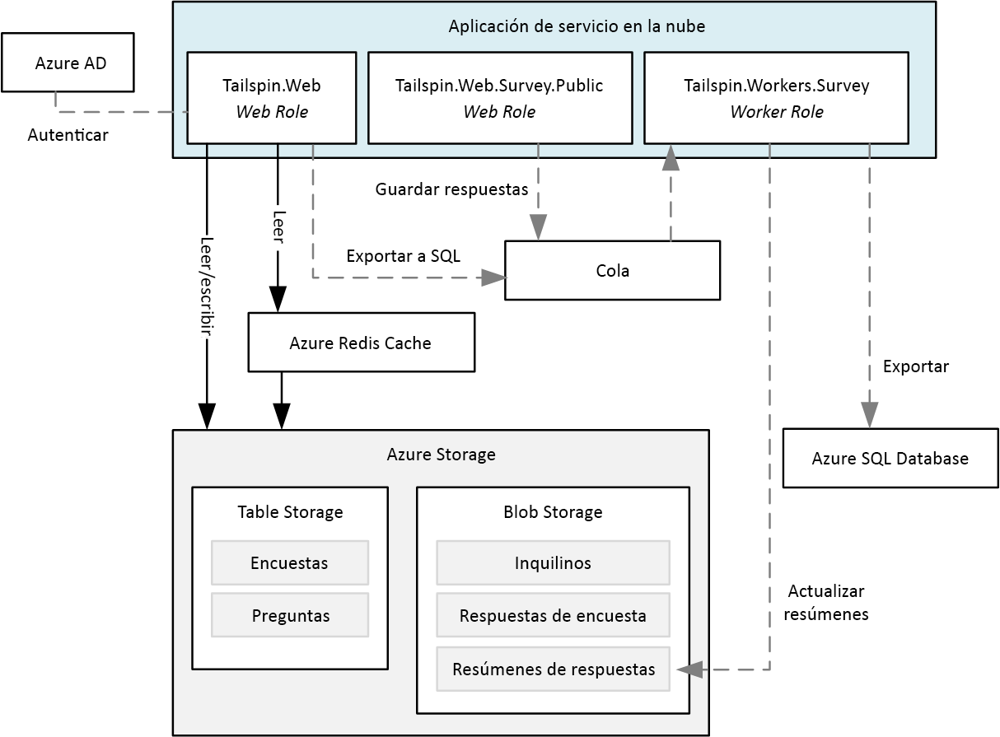
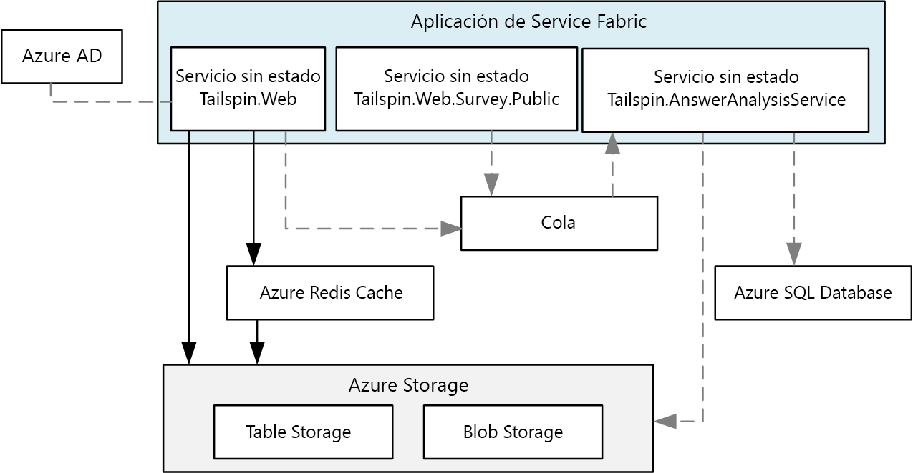
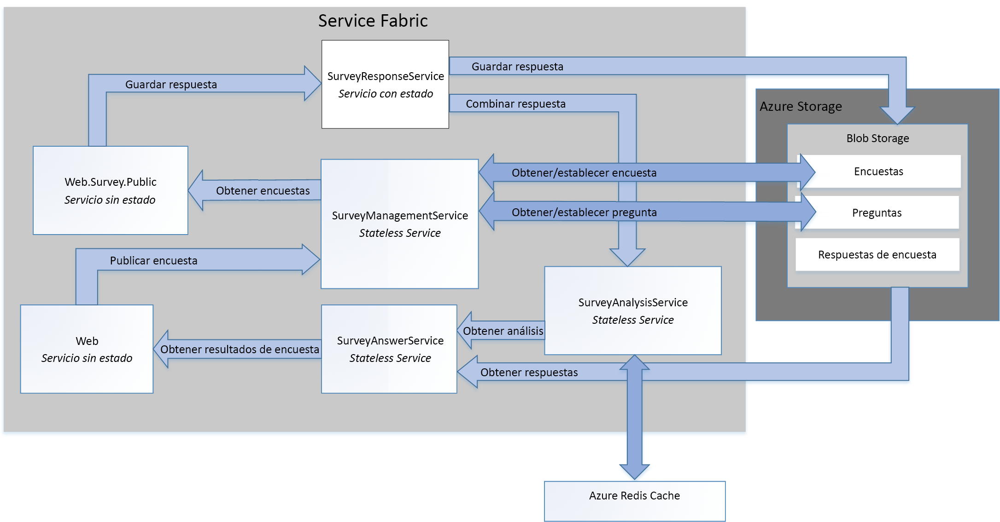

# <a name="refactor-an-azure-service-fabric-application-migrated-from-azure-cloud-services"></a>Refactorización de una aplicación de Azure Service Fabric migrada de Azure Cloud Services

[ Código de ejemplo][sample-code]

En este artículo se describe cómo refactorizar una aplicación de Azure Service Fabric para obtener una arquitectura más pormenorizada. Este artículo aborda cuestiones sobre el diseño, el empaquetado, el rendimiento y la implementación de la aplicación de Service Fabric refactorizada.

## <a name="scenario"></a>Escenario

Tal y como se describe en el artículo anterior, [Migración de una aplicación de Azure Cloud Services a Azure Service Fabric][migrate-from-cloud-services], el grupo de modelos y prácticas creó un libro en 2012 que documentaba el proceso de diseño e implementación de una aplicación de Cloud Services en Azure. En este libro se describe una compañía ficticia denominada Tailspin que desea crear una aplicación de Cloud Services llamada **Surveys**. La aplicación Surveys permite a los usuarios crear y publicar encuestas que el público puede responder. El siguiente diagrama muestra la arquitectura de esta versión de la aplicación Surveys:



El rol web **Tailspin.Web** hospeda un sitio de ASP.NET MVC que los clientes de Tailspin usan para:
* registrarse en la aplicación Surveys;
* crear o eliminar una única encuesta;
* ver los resultados de una única encuesta;
* solicitar que los resultados de la encuesta se exporten a SQL;
* ver los resultados y análisis agregados de las encuestas.

El rol web **Tailspin.Web.Survey.Public** también hospeda un sitio de ASP.NET MVC que el público visita para completar las encuestas. Estas respuestas se ponen en cola para guardarse.

El rol de trabajo **Tailspin.Workers.Survey** recoge solicitudes de varias colas para realizar el procesamiento en segundo plano.

El grupo de modelos y prácticas creó después un nuevo proyecto para portar esta aplicación a Azure Service Fabric. El objetivo de este proyecto era realizar únicamente las modificaciones necesarias en el código para poder ejecutar la aplicación en un clúster de Azure Service Fabric. En consecuencia, los roles web y de trabajo originales no se descompusieron en una arquitectura más pormenorizada. La arquitectura resultante es muy similar a la versión de la aplicación para el servicio en la nube:



El servicio **Tailspin.Web** se porta desde el rol web *Tailspin.Web* original.

El servicio **Tailspin.Web.Survey.Public** se porta desde el rol web *Tailspin.Web.Survey.Public* original.

El servicio **Tailspin.AnswerAnalysisService** se porta desde el rol de trabajo *Tailspin.Workers.Survey* original.

> [!NOTE] 
> Aunque apenas se realizaron cambios en el código en cada uno de los roles web y de trabajo, **Tailspin.Web** y **Tailspin.Web.Survey.Public** se modificaron para autohospedar un servidor web [Kestrel]. La aplicación Surveys anterior es una aplicación ASP.Net que se hospedaba mediante Internet Information Services (IIS), pero no es posible ejecutar IIS como un servicio en Service Fabric. Por lo tanto, cualquier servidor web debe ser capaz de autohospedarse, como [Kestrel]. En ciertos casos, es posible ejecutar IIS en un contenedor en Service Fabric. Consulte los [escenarios para usar contenedores][container-scenarios] para más información.  

Ahora, Tailspin refactoriza la aplicación Surveys a una arquitectura más pormenorizada. El objetivo de Tailspin al refactorizar es facilitar el desarrollo, la compilación y la implementación de la aplicación Surveys. Al descomponer los roles web y de trabajo existentes en una arquitectura más pormenorizada, Tailspin busca eliminar las dependencias de comunicación y datos estrechamente acopladas existentes entre estos roles.

Tailspin encuentra otras ventajas al trasladar la aplicación Surveys a una arquitectura más pormenorizada:
* Cada servicio se puede empaquetar en proyectos independientes con un ámbito lo suficientemente pequeño como para que un equipo reducido pueda administrarlo.
* El control de versiones y la implementación de cada servicio pueden realizarse de manera independiente.
* Cada servicio puede implementarse mediante la tecnología óptima para ese servicio. Por ejemplo, un clúster de Service Fabric puede incluir servicios creados con distintas versiones de .Net Framework, Java u otros lenguajes como C o C++.
* Cada servicio se puede escalar independientemente para responder a aumentos y disminuciones de carga.

> [!NOTE] 
> La arquitectura multiinquilino está fuera del ámbito de la refactorización de esta aplicación. Tailspin dispone de varias opciones para admitir la arquitectura multiinquilino y puede tomar estas decisiones de diseño más adelante sin que ello afecte al diseño inicial. Por ejemplo, Tailspin puede crear instancias independientes de los servicios para cada inquilino dentro de un clúster o crear un clúster independiente para cada inquilino.

## <a name="design-considerations"></a>Consideraciones de diseño
 
El siguiente diagrama muestra la arquitectura de la aplicación Surveys refactorizada para obtener una arquitectura más pormenorizada:



**Tailspin.Web** es un servicio sin estado que autohospeda una aplicación de ASP.NET MVC que los clientes de Tailspin visitan para crear encuestas y ver resultados de encuestas. Este servicio comparte la mayor parte de su código con el servicio *Tailspin.Web* de la aplicación de Service Fabric portada. Como se mencionó anteriormente, este servicio utiliza ASP.NET Core y pasa de utilizar Kestrel como front-end web a implementar WebListener.

**Tailspin.Web.Survey.Public** es un servicio sin estado que también autohospeda un sitio de ASP.NET MVC. Los usuarios visitan este sitio para seleccionar encuestas de una lista y completarlas. Este servicio comparte la mayor parte de su código con el servicio *Tailspin.Web.Survey.Public* de la aplicación de Service Fabric portada. Este servicio también utiliza ASP.NET Core y pasa de utilizar Kestrel como front-end web a implementar WebListener.

**Tailspin.SurveyResponseService** es un servicio con estado que almacena las respuestas de las encuestas en Azure Blob Storage. También combina respuestas en los datos de análisis de encuestas. El servicio se implementa como un servicio con estado porque utiliza [ReliableConcurrentQueue][reliable-concurrent-queue] para procesar respuestas de encuesta en lotes. Esta funcionalidad estaba implementada originalmente en el servicio *Tailspin.AnswerAnalysisService* en la aplicación de Service Fabric portada.

**Tailspin.SurveyManagementService** es un servicio sin estado que almacena y recupera encuestas y preguntas de encuesta. El servicio utiliza Azure Blob Storage. Esta funcionalidad estaba también implementada originalmente en los componentes de acceso a datos de los servicios *Tailspin.Web* y *Tailspin.Web.Survey.Public* en la aplicación de Service Fabric portada. Tailspin refactorizó la funcionalidad original en este servicio para que pueda escalarse de forma independiente.

**Tailspin.SurveyAnswerService** es un servicio sin estado que recupera respuestas y análisis de encuestas. El servicio también utiliza Azure Blob Storage. Esta funcionalidad estaba también implementada originalmente en los componentes de acceso a datos del servicio *Tailspin.Web* en la aplicación de Service Fabric portada. Tailspin refactorizó la funcionalidad original en este servicio porque espera menos carga y desea usar menos instancias para conservar recursos.

**Tailspin.SurveyAnalysisService** es un servicio sin estado que conserva datos de resumen de respuestas de encuestas en una instancia de Redis Cache para recuperarlos rápidamente. Mediante *Tailspin.SurveyResponseService*, se llama a este servicio cada vez que se responde una encuesta y los nuevos datos de respuesta de la encuesta se combinan en los datos de resumen. Este servicio incluye la funcionalidad implementada originalmente en el servicio *Tailspin.AnswerAnalysisService* en la aplicación de Service Fabric portada.

## <a name="stateless-versus-stateful-services"></a>Servicios sin estado y con estado

Azure Service Fabric admite los siguientes modelos de programación:
* El modelo de ejecutable invitado permite que cualquier ejecutable se empaquete como un servicio y se implemente en un clúster de Service Fabric. Service Fabric organiza y administra la ejecución del ejecutable invitado.
* El modelo de contenedor permite la implementación de servicios en imágenes de contenedor. Service Fabric permite crear y administrar contenedores sobre contenedores del kernel de Linux, así como sobre contenedores de Windows Server. 
* El modelo de programación de Reliable Services permite crear servicios con o sin estado que se integran con todas las características de la plataforma de Service Fabric. Los servicios con estado permiten almacenar el estado replicado en el clúster de Service Fabric, mientras que los servicios sin estado no lo permiten.
* El modelo de programación de Reliable Actors permite crear servicios que implementan el patrón de actor virtual.

Todos los servicios de la aplicación Surveys son servicios confiables sin estado, excepto el servicio *Tailspin.SurveyResponseService*. Este servicio implementa [ReliableConcurrentQueue][reliable-concurrent-queue] para procesar respuestas de encuesta al recibirlas. Las respuestas en ReliableConcurrentQueue se guardan en Azure Blob Storage y se transfieren a *Tailspin.SurveyAnalysisService* para su análisis. Tailspin elige ReliableConcurrentQueue porque las respuestas no requieren el orden estricto "primero en entrar, primero en salir" que proporciona una cola, como Azure Service Bus. ReliableConcurrentQueue también está diseñado para ofrecer un alto rendimiento y una baja latencia para las operaciones de puesta en cola y eliminación de cola.

Tenga en cuenta que, idealmente, las operaciones para conservar elementos quitados de la cola de ReliableConcurrentQueue deberían ser idempotentes. Si se produce una excepción durante el procesamiento de un elemento de la cola, el mismo elemento se puede procesar más de una vez. En la aplicación Surveys, la operación para combinar respuestas de encuesta en el servicio *Tailspin.SurveyAnalysisService* no es idempotente, ya que Tailspin decidió que los datos de análisis de encuestas sean únicamente una instantánea actual de los datos de análisis y no es necesario que sean coherentes. Las respuestas de encuesta que se guardan en Azure Blob Storage son coherentes en última instancia, por lo que el análisis de encuestas final siempre se puede recalcular correctamente a partir de estos datos.

## <a name="communication-framework"></a>Marco de comunicación

Cada servicio de la aplicación Surveys se comunica mediante una API web de RESTful. Las API de RESTful proporcionan las siguientes ventajas:
* Facilidad de uso: cada servicio se basa en ASP.Net Core MVC, que admite de forma nativa la creación de API web.
* Seguridad: aunque los servicios no requieren capa de sockets seguros, Tailspin podría determinar que cada servicio lo requiera. 
* Control de versiones: los clientes se pueden escribir y probar en una versión específica de una API web.

Los servicios de la aplicación Surveys usan el [proxy inverso][reverse-proxy] implementado por Service Fabric. El proxy inverso es un servicio que se ejecuta en cada nodo del clúster de Service Fabric y gestiona la resolución de puntos de conexión, el reintento automático y otros tipos de errores de conexión. Para usar al proxy inverso, cada llamada de API de RESTful a un servicio específico se realiza mediante un puerto de proxy inverso predefinido.  Por ejemplo, si se ha establecido el puerto de proxy inverso en **19081**, una llamada a *Tailspin.SurveyAnswerService* puede realizarse de la siguiente manera:

```csharp
static SurveyAnswerService()
{
    httpClient = new HttpClient
    {
        BaseAddress = new Uri("http://localhost:19081/Tailspin/SurveyAnswerService/")
    };
}
```
Para habilitar el proxy inverso, especifique un puerto de proxy inverso durante la creación del clúster de Service Fabric. Para más información, consulte [Proxy inverso][reverse-proxy] de Azure Service Fabric.

## <a name="performance-considerations"></a>Consideraciones sobre rendimiento

Tailspin creó servicios de ASP.NET Core para *Tailspin.Web* y *Tailspin.Web.Surveys.Public* mediante plantillas de Visual Studio. De forma predeterminada, estas plantillas incluyen el registro en la consola. El registro en la consola puede realizarse durante el desarrollo y la depuración, pero todos los registros de la consola deben eliminarse cuando la aplicación se implementa en producción.

> [!NOTE]
> Para más información sobre la configuración de supervisión y diagnóstico para aplicaciones de Service Fabric que se ejecutan en producción, consulte [Supervisión y diagnóstico][monitoring-diagnostics] para Azure Service Fabric.

Por ejemplo, las siguientes líneas en *startup.cs* para cada uno de los servicios front-end web deben convertirse en comentarios:

```csharp
// This method gets called by the runtime. Use this method to configure the HTTP request pipeline.
public void Configure(IApplicationBuilder app, IHostingEnvironment env, ILoggerFactory loggerFactory)
{
    //loggerFactory.AddConsole(Configuration.GetSection("Logging"));
    //loggerFactory.AddDebug();

    app.UseMvc();
}
```

> [!NOTE]
> Estas líneas pueden excluirse condicionalmente cuando Visual Studio se establece en "Liberar" al publicar.

Por último, cuando Tailspin implementa la aplicación Tailspin en producción, cambia el modo de Visual Studio a **Liberar**.

## <a name="deployment-considerations"></a>Consideraciones de la implementación

La aplicación Surveys refactorizada se compone de cinco servicios sin estado y un servicio con estado, por lo que el planeamiento de clústeres se limita a determinar el tamaño correcto de la máquina virtual y el número de nodos. En el archivo *applicationmanifest.xml* que describe el clúster, Tailspin establece el atributo *InstanceCount* de la etiqueta *StatelessService* en -1 para cada uno de los servicios. Un valor de -1 indica a Service Fabric que cree una instancia del servicio en cada nodo del clúster.

> [!NOTE]
> Los servicios con estado requieren el paso adicional de planear el número correcto de particiones y réplicas de sus datos.

Tailspin implementa el clúster mediante Azure Portal. El tipo de recurso de clúster de Service Fabric implementa toda la infraestructura necesaria, incluidos los conjuntos de escalado de la máquina virtual y un equilibrador de carga. Los tamaños de máquina virtual recomendados se muestran en Azure Portal durante el proceso de aprovisionamiento para el clúster de Service Fabric. Tenga en cuenta que dado que las máquinas virtuales se implementan en un conjunto de escalado de máquina virtual, se pueden escalar tanto vertical como horizontalmente a medida que aumente la carga de usuarios.

> [!NOTE]
> Tal y como se indicó anteriormente, en la versión migrada de la aplicación Surveys, los dos servidores front-end web estaban autohospedados con ASP.Net Core y Kestrel como servidor web. Aunque la versión migrada de la aplicación Surveys no utiliza un proxy inverso, se recomienda encarecidamente usar uno, como IIS, Nginx o Apache. Para más información, consulte la [introducción a la implementación del servidor web Kestrel en ASP.NET Core][kestrel-intro].
> En la aplicación Surveys refactorizada, los dos servidores front-end web se autohospedan mediante ASP.Net Core con [WebListener][weblistener] como servidor web, por lo que no es necesario un proxy inverso.

## <a name="next-steps"></a>pasos siguientes

El código de la aplicación Surveys está disponible en [GitHub][sample-code].

Si es la primera vez que usa [Azure Service Fabric][service-fabric], primero configure el entorno de desarrollo y, a continuación, descargue la versión más reciente del [SDK de Azure][azure-sdk] y del [SDK de Azure Service Fabric][service-fabric-sdk]. El SDK incluye el administrador de clústeres OneBox, de forma que puede implementar y probar la aplicación Surveys localmente con depuración de F5 completa.

<!-- links -->
[azure-sdk]: https://azure.microsoft.com/downloads/archive-net-downloads/
[container-scenarios]: /azure/service-fabric/service-fabric-containers-overview
[kestrel]: https://docs.microsoft.com/aspnet/core/fundamentals/servers/kestrel?tabs=aspnetcore2x
[kestrel-intro]: https://docs.microsoft.com/aspnet/core/fundamentals/servers/kestrel?tabs=aspnetcore1x
[migrate-from-cloud-services]: migrate-from-cloud-services.md
[monitoring-diagnostics]: /azure/service-fabric/service-fabric-diagnostics-overview
[reliable-concurrent-queue]: /azure/service-fabric/service-fabric-reliable-services-reliable-concurrent-queue
[reverse-proxy]: /azure/service-fabric/service-fabric-reverseproxy
[sample-code]: https://github.com/mspnp/cloud-services-to-service-fabric/tree/master/servicefabric-phase-2
[service-fabric]: /azure/service-fabric/service-fabric-get-started
[service-fabric-sdk]: /azure/service-fabric/service-fabric-get-started
[weblistener]: https://docs.microsoft.com/aspnet/core/fundamentals/servers/weblistener
